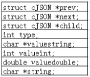
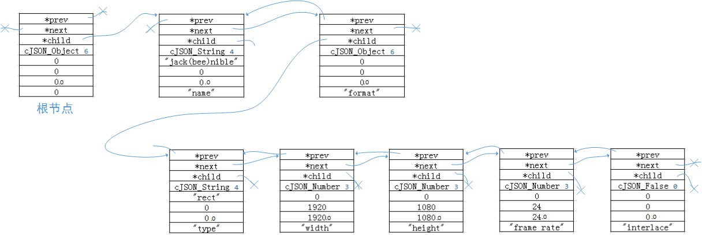

cjson是一个用c语言开发的json解析库，免费开源只有一个c文件和一个h文件。

json和xml功能相似，可以用来传输数据，存储数据以及表达程序当前的状态。

* 下载cjson的源码

        https://github.com/DaveGamble/cJSON
        
* 阅读readme文件可以大概的了解一下cjson的介绍以及使用方法，我尝试着把readme文件做了一下翻译，水平有限，大概意思写在了“cjson工程的readme文件翻译”，可以参考原文来对照看，如果只是想快速应用一下cjson库的话，看完应该能知道如何使用这个cjson库了。

* 源码分析

   如果本着不了解其实现无法安心使用的心态的话，可以看一下下面的源码解析。

   将头文件和源码进行分开，然后注释都添加在了代码里（基本上都是根据自己对英文的理解进行翻译的），至于测试例程，其实cjson的源码提供了一个test.c。这个文件里面里面提供了一个比较全面的测试用例。附件里面是整理完格式和加了注释后的cJSON源码
  
cJSON.h：

```
#ifndef cJSON__h
#define cJSON__h


#ifdef __cplusplus
extern "C"
{
#endif


//以宏的方式定义出的几种cJson对象的类型
#define cJSON_False 0
#define cJSON_True 1
#define cJSON_NULL 2
#define cJSON_Number 3
#define cJSON_String 4
#define cJSON_Array 5
#define cJSON_Object 6
	
#define cJSON_IsReference 256
#define cJSON_StringIsConst 512


//cJSON的数据结构
typedef struct cJSON 
{
	/* next/prev 用来遍历所有的数组或者对象链表. 一般来说可以调用GetArraySize/GetArrayItem/GetObjectItem 进行操作*/
	struct cJSON *next,*prev;	
	/* 一个数组或者对象会有一个孩子节点指针指向一个对象或者数组链 */
	struct cJSON *child;		
	/* 这个节点的类型, 为上面定义的宏 */
	int type;					
	/* 是节点的值 如果节点的类型是cJSON_String的话 */
	char *valuestring;			
	/* 是节点的值 如果节点的类型是cJSON_Number的话 */
	int valueint;				
	/* 是节点的值 如果节点的类型是cJSON_Number的话 */
	double valuedouble;
	/* 节点的名字*/
	char *string;				
} cJSON;
//钩子?将申请内存和释放内存的接口进行管理。
typedef struct cJSON_Hooks {
      void *(*malloc_fn)(size_t sz);
      void (*free_fn)(void *ptr);
} cJSON_Hooks;


//为cJSON提供 malloc realloc 和 free函数
extern void cJSON_InitHooks(cJSON_Hooks* hooks);


//提供一个JSON的内存块，返回出从value传入的字符串中携带的json信息使你后续可以进行提取。在完成工作之后要使用cJSON_Delete进行释放
extern cJSON *cJSON_Parse(const char *value);


//将一个json数据转换为文本数据，用来方便转发和存储。在完成工作之后要释放char *
extern char  *cJSON_Print(cJSON *item);
//将一个json数据转换为不含有任何格式的文本数据，用来方便转发和存储。在完成工作之后要释放char *
extern char  *cJSON_PrintUnformatted(cJSON *item);
/* 使用缓存的策略将json数据打印到缓冲区中. prebuffer是预测的缓存大小. 认为可以很好的减少内存重复分配.
 * fmt=0 不含有任何格式,
 *  fmt=1 含有格式
 */
extern char *cJSON_PrintBuffered(cJSON *item,int prebuffer,int fmt);
/* 删除整个json结构体和其所有子项 */
extern void   cJSON_Delete(cJSON *c);


/* 返回一个对象或者数组中所有的元素个数*/
extern int	  cJSON_GetArraySize(cJSON *array);
/* 检索数组array中第item个元素，不成功则返回NULL */
extern cJSON *cJSON_GetArrayItem(cJSON *array,int item);
/*获取"string"指定的对象. 不区分大小写. */
extern cJSON *cJSON_GetObjectItem(cJSON *object,const char *string);


/* 用来分析错误的解析.返回一个指向解析错误位置的指针。你可能需要从这个位置往回检查几个字符. 解析成功则返回0. */
extern const char *cJSON_GetErrorPtr(void);


/*下面的这些调用用来根据指定的类型创建cjson的节点。*/
extern cJSON *cJSON_CreateNull(void);
extern cJSON *cJSON_CreateTrue(void);
extern cJSON *cJSON_CreateFalse(void);
extern cJSON *cJSON_CreateBool(int b);
extern cJSON *cJSON_CreateNumber(double num);
extern cJSON *cJSON_CreateString(const char *string);
extern cJSON *cJSON_CreateArray(void);
extern cJSON *cJSON_CreateObject(void);


/*下面的这些用来建立count个节点*/
extern cJSON *cJSON_CreateIntArray(const int *numbers,int count);
extern cJSON *cJSON_CreateFloatArray(const float *numbers,int count);
extern cJSON *cJSON_CreateDoubleArray(const double *numbers,int count);
extern cJSON *cJSON_CreateStringArray(const char **strings,int count);


/*将指定的节点添加到数组或者对象中 */
extern void cJSON_AddItemToArray(cJSON *array, cJSON *item);
extern void	cJSON_AddItemToObject(cJSON *object,const char *string,cJSON *item);
/* 当字符串是常量的时候使用下面这个接口 */
extern void	cJSON_AddItemToObjectCS(cJSON *object,const char *string,cJSON *item);	
/*添加指定的节点到指定的对象或者数组中. 把一个存在的cJSON添加到一个新的cJSON但是又不想销毁已经存在的这个cJSON使用这一组接口*/
extern void cJSON_AddItemReferenceToArray(cJSON *array, cJSON *item);
extern void	cJSON_AddItemReferenceToObject(cJSON *object,const char *string,cJSON *item);


/* 从一个数组或者对象中删除指定的节点 */
extern cJSON *cJSON_DetachItemFromArray(cJSON *array,int which);
extern void   cJSON_DeleteItemFromArray(cJSON *array,int which);
extern cJSON *cJSON_DetachItemFromObject(cJSON *object,const char *string);
extern void   cJSON_DeleteItemFromObject(cJSON *object,const char *string);
	
/* 更新数组中的节点. */
extern void cJSON_InsertItemInArray(cJSON *array,int which,cJSON *newitem);	/* 将原有的节点右移. */
extern void cJSON_ReplaceItemInArray(cJSON *array,int which,cJSON *newitem);
extern void cJSON_ReplaceItemInObject(cJSON *object,const char *string,cJSON *newitem);


/* 复制一个cJSON对象 */
extern cJSON *cJSON_Duplicate(cJSON *item,int recurse);
/* Duplicate会创建一个与传入参数完全相同的对象, 在新的内存中需要释放。
 *当recurse!=0，将会复制这个对象中的所有的孩子节点。
 *返回对象中的item->next 和 ->prev指针通常是0。
 */


/* ParseWithOpts允许你去指定或者检查字符串是否以NULL结尾, 同时可以检索解析后的字符串的最后一个位置. */
extern cJSON *cJSON_ParseWithOpts(const char *value,const char **return_parse_end,int require_null_terminated);
//一个精简后的解析框架
extern void cJSON_Minify(char *json);


/* 宏，用来做快速建立并添加操作. */
#define cJSON_AddNullToObject(object,name)		cJSON_AddItemToObject(object, name, cJSON_CreateNull())
#define cJSON_AddTrueToObject(object,name)		cJSON_AddItemToObject(object, name, cJSON_CreateTrue())
#define cJSON_AddFalseToObject(object,name)		cJSON_AddItemToObject(object, name, cJSON_CreateFalse())
#define cJSON_AddBoolToObject(object,name,b)	cJSON_AddItemToObject(object, name, cJSON_CreateBool(b))
#define cJSON_AddNumberToObject(object,name,n)	cJSON_AddItemToObject(object, name, cJSON_CreateNumber(n))
#define cJSON_AddStringToObject(object,name,s)	cJSON_AddItemToObject(object, name, cJSON_CreateString(s))


/* 当赋值一个整数的时候, 需要对浮点数也进行同时赋值. */
#define cJSON_SetIntValue(object,val)			((object)?(object)->valueint=(object)->valuedouble=(val):(val))
#define cJSON_SetNumberValue(object,val)		((object)?(object)->valueint=(object)->valuedouble=(val):(val))


#ifdef __cplusplus
}
#endif


#endif

```

以上为cjson的头文件中的内容，其中定义cjson结构体以及操作json数据的接口，对于cjson结构体来说通过之前的readme文件可以大致的根据一个样例数据进行示例其在内存中的组织方式，而各个接口的实现则在后续的cjson.c的分析中进行展开。

在绘图时，对于cjson结构的组织如下图所示：



```
{
    "name": "Jack (\"Bee\") Nimble", 
    "format": {
        "type":       "rect", 
        "width":      1920, 
        "height":     1080, 
        "interlace":  false, 
        "frame rate": 24
    }
}
```

cjson将上面所示例的json数据在内存中组织方式如下图所示（char*实际情况应为指向动态申请的内存的指针，但为了方便起见图中约定char*使用值直接替换）：



下面是对于cJSON.c中的源码分析。

cJSON.c

```
/* cJSON */
/* JSON parser in C. */


#include <string.h>
#include <stdio.h>
#include <math.h>
#include <stdlib.h>
#include <float.h>
#include <limits.h>
#include <ctype.h>
#include "cJSON.h"


/* ep静态全局指针，指向字符串，*/
static const char *ep;
/*返回ep所指向字符串的地址，使用const修饰返回值，说明ep所指向的字符串是常量，
   应该是写死在出错方式上。所以不需要释放其返回的指针的*/
const char *cJSON_GetErrorPtr(void) 
{
	return ep;
}
/*忽略大小写比较字符串s1和s2, 参数使用const进行修饰，说明内部不会修改这两个值。
 *static说明文件内作用域，返回整数，
 *=0 - 相等；
 *>0 - s1>s2；
 *<0 - s1<s2；
 */
static int cJSON_strcasecmp(const char *s1,const char *s2)
{
	//s1==NULL的情况下，如果s2也是NULL就相等，不然就是s1<s2;
	if (!s1) 
		return (s1==s2)?0:1;
	//s1不是NULL，但是s2是NULL,那么s1>s2
	if (!s2) 
		return 1;
	//不区分大小写，即都以小写形式进行比较，循环比较每个字符。不相等则跳出循环。
	for(; tolower(*s1) == tolower(*s2); ++s1, ++s2)	
		if(*s1 == 0)//如果这个条件为真，说明s1==s2，s1==NULL。即，两个字串不区分大小写相同
			return 0;
	//将不相同的那个字符的小写形式进行相减，可以得到两个串的大小。
	//强制转换防止报错吧。
	return tolower(*(const unsigned char *)s1) - tolower(*(const unsigned char *)s2);
}


/*对静态全局函数指针变量进行赋值，使cJSON_malloc=malloc，使cJSON_free=free*/
static void *(*cJSON_malloc)(size_t sz) = malloc;
static void (*cJSON_free)(void *ptr) = free;
/*静态作用域，返回char*类型指针，该指针指向从str中复制出内容的一块新申请的内存地址，str为const，不可修改*/
static char* cJSON_strdup(const char* str)
{
      size_t len;
      char* copy;
	  //获取字符串长度，并考虑了最后一个结束符号。
      len = strlen(str) + 1;
	  //申请len个长度内存并类型转换和测试是否申请成功，不成功就返回NULL。
      if (!(copy = (char*)cJSON_malloc(len))) return 0;
	  //申请成功就拷贝len长度个串进去。然后将首地址返回
      memcpy(copy,str,len);
      return copy;
}
/*初始化钩子，其实所谓钩子在这里也就是内存申请和释放接口*/
void cJSON_InitHooks(cJSON_Hooks* hooks)
{
	//判断传入的指针为NULL，那么就使用系统的申请和释放接口
    if (!hooks) { /* Reset hooks */
        cJSON_malloc = malloc;
        cJSON_free = free;
        return;
    }
	//然后根据传入参数中是否携带指定的申请和释放接口，进行选择使用哪一个内存接口。
	cJSON_malloc = (hooks->malloc_fn)?hooks->malloc_fn:malloc;
	cJSON_free	 = (hooks->free_fn)?hooks->free_fn:free;
}


/*申请一个cJSON结构体大小的内存，初始化为0，静态作用域*/
static cJSON *cJSON_New_Item(void)
{
	//申请内存，测试，赋值为0，返回指针。
	cJSON* node = (cJSON*)cJSON_malloc(sizeof(cJSON));
	if (node)
		memset(node,0,sizeof(cJSON));
	return node;
}


/*删除一个cJSON结构体，还应该循环将它的所有子项进行删除清理*/
/*对于c->type的0、1、2、3、4、5、6和256以及512做与预算到底是为什么要这么做呢?*/
void cJSON_Delete(cJSON *c)
{
	cJSON *next;
	while (c)
	{
		//记录c节点的下一个节点。
		next=c->next;
		//c->type&cJSON_IsReference将type与256做与运算，判断有孩子节点则进行递归
		if (!(c->type&cJSON_IsReference) && c->child) 
			cJSON_Delete(c->child);
		//valuestring不为NULL，需要释放内存
		if (!(c->type&cJSON_IsReference) && c->valuestring)
			cJSON_free(c->valuestring);
		//string不为NULL，需要释放内存
		if (!(c->type&cJSON_StringIsConst) && c->string)
			cJSON_free(c->string);
		//删除这个节点
		cJSON_free(c);
		//继续下一个节点
		c=next;
	}
}


/*将输入的num解析成一个数字，然后将结果填充到节点中
 *静态作用域，const返回值为传入字串解析完后第一个不为数值的位置，解析num到item中
 */
static const char *parse_number(cJSON *item,const char *num)
{
	double n=0,sign=1,scale=0;
	int subscale=0,signsubscale=1;
	//是否为负数
	if (*num=='-')
		sign=-1,num++;
	//是否为0
	if (*num=='0') 
		num++;
	//如果是十进制就进行解析，临时变量存到n中
	if (*num>='1' && *num<='9')
		do
			n=(n*10.0)+(*num++ -'0');	
		while (*num>='0' && *num<='9');
	//如果存在小数点，将数字继续转存到n的末尾以整数方式，但是使用scale记录有几位小数
	if (*num=='.' && num[1]>='0' && num[1]<='9') 
	{
		num++;
		do
			n=(n*10.0)+(*num++ -'0'),scale--; 
		while (*num>='0' && *num<='9');
	}
	//如果是指数计数方式，记录指数符号，然后将数字进行转存到subscale中
	if (*num=='e' || *num=='E')
	{	
		num++;
		if (*num=='+')
			num++;
		else if (*num=='-') 
			signsubscale=-1,num++;	
		while (*num>='0' && *num<='9') 
			subscale=(subscale*10)+(*num++ - '0');
	}
	/* number = +/- number.fraction * 10^+/- exponent */
	n=sign*n*pow(10.0,(scale+subscale*signsubscale));
	//将计算到的值赋值到item中，int和double项都要赋值。类型赋值为NUM
	item->valuedouble=n;
	item->valueint=(int)n;
	item->type=cJSON_Number;
	return num;
}
/*返回大于x的最小的2的幂，静态作用域*/
/*在实现上就是把x占用到的最高位为1的位到第0位，都置位为1*/
static int pow2gt (int x)	
{
	//--x是为了防止x直接就是2的幂的情况。
	--x;
	x|=x>>1;	x|=x>>2;	x|=x>>4;	x|=x>>8;	x|=x>>16;	
	return x+1;	
}
//定义一个printbuffer类型，主要是用来将json数据打印到缓冲区时，进行提供缓存空间的信息。
typedef struct 
{
	char *buffer; //缓存地址指针
	int length;   //缓存当前的长度
	int offset;  //缓存当前已经使用到的位置。
} printbuffer;
/*
 *ensure 意为确保的意思，这里可以理解为，确保p所指向的缓冲区中能够提供needed大小的缓冲给打印功能使用
 *静态作用域，返回缓冲区中可以继续使用的空间的位置。needed在里面做了局部变量，修改使用均无碍，
 *减少了一个中间变量。
 */
static char* ensure(printbuffer *p,int needed)
{
	char *newbuffer;int newsize;
	//如果p=NULL,或者p->buffer=NULL,那么为运行时检查错误，返回空指针
	if (!p || !p->buffer)
		return 0;
	//计算将当前所需的空间加上之前已用的空间一共需要内存的数目
	needed+=p->offset;
	//如果现在p->buffer足够容下所有的值，那么就返回当前缓存中最后一个可用的位置
	if (needed<=p->length) 
		return p->buffer+p->offset;
	/*下面为处理当前缓存不能存下所有的信息的时候*/
	//计算大于当前所需数目的最小2de幂，用来分配内存数目
	newsize=pow2gt(needed);
	//申请内存并做错误检查，如果失败那么就置空后返回空指针。
	newbuffer=(char*)cJSON_malloc(newsize);
	if (!newbuffer)
	{
		cJSON_free(p->buffer);
		p->length=0,
		p->buffer=0;
		return 0;
	}
	//申请成功后将原有数据拷贝到新空间中。
	if (newbuffer) 
		memcpy(newbuffer,p->buffer,p->length);
	//释放原指针，并更新新的缓存信息，然后返回缓存中第一个可用的内存位置。
	cJSON_free(p->buffer);
	p->length=newsize;
	p->buffer=newbuffer;
	return newbuffer+p->offset;
}
/*静态作用域函数，意为更新，传入参数为缓存结构，返回当前缓存区已使用的内存偏移量*/
static int update(printbuffer *p)
{
	char *str;
	//运行时错误检查
	if (!p || !p->buffer) 
		return 0;
	//将str定义到新加入缓存的数据的首地址。然后使用strlen计算新添加长度后加上原有的偏移量进行返回。
	str=p->buffer+p->offset;
	return p->offset+strlen(str);
}


/*静态作用域，将item中的数字打印成字符串，
 *当p不为NULL时，使用的是p所指向的内存缓冲区，当p为NULL时，使用的是单独申请的内存
 */
static char *print_number(cJSON *item,printbuffer *p)
{
	char *str=0;
	double d=item->valuedouble;
	//如果item的数值为0，使用两个字节，根据p是否为空，决定使用从哪里分配的缓存，并将字符串"0"拷贝到缓存中。
	if (d==0)
	{
		if (p)	str=ensure(p,2);
		else	str=(char*)cJSON_malloc(2);	/* special case for 0. */
		if (str) strcpy(str,"0");
	}
	//如果item的数值为整数，21个char肯定装的下，并验证数值的正确性。
	//(fabs(((double)item->valueint)-d)<=DBL_EPSILON，标示差小于最小误差值，即可以理解为整数，并用INT_MAX、INT_MIN，验证合法性数据。
	else if (fabs(((double)item->valueint)-d)<=DBL_EPSILON && d<=INT_MAX && d>=INT_MIN)
	{
		if (p)	str=ensure(p,21);
		else	str=(char*)cJSON_malloc(21);	/* 2^64+1 can be represented in 21 chars. */
		if (str)	sprintf(str,"%d",item->valueint);
	}
	//走到这里，肯定是小数，选用64个字节较为合适。
	else
	{
		if (p)	str=ensure(p,64);
		else	str=(char*)cJSON_malloc(64);	/* This is a nice tradeoff. */
		if (str)
		{
			//如果小数值特别接近零，并且整数部分值特别大，那么就以xxxxx.0方式输出
			if (fabs(floor(d)-d)<=DBL_EPSILON && fabs(d)<1.0e60)sprintf(str,"%.0f",d);
			//如果数值比1.0e-6小或者比1.0e9数值大，那么比较适合用科学计数法标示
			else if (fabs(d)<1.0e-6 || fabs(d)>1.0e9)			sprintf(str,"%e",d);
			//剩余部分直接用小数点形式进行输出
			else												sprintf(str,"%f",d);
		}
	}
	return str;
}
/*从16进制整数的字符串表达方式转换成无符号整数*/
/*静态作用域，返回无符号整数，参数不可修改*/
static unsigned parse_hex4(const char *str)
{
	//将字符串的字符逐个取出进行分析，然后计算到整数中。然后将h左移一个直接再进行下一个数字的解析。最后完成4个字节的整数解析
	unsigned h=0;
	if (*str>='0' && *str<='9') h+=(*str)-'0'; else if (*str>='A' && *str<='F') h+=10+(*str)-'A'; else if (*str>='a' && *str<='f') h+=10+(*str)-'a'; else return 0;
	h=h<<4;str++;
	if (*str>='0' && *str<='9') h+=(*str)-'0'; else if (*str>='A' && *str<='F') h+=10+(*str)-'A'; else if (*str>='a' && *str<='f') h+=10+(*str)-'a'; else return 0;
	h=h<<4;str++;
	if (*str>='0' && *str<='9') h+=(*str)-'0'; else if (*str>='A' && *str<='F') h+=10+(*str)-'A'; else if (*str>='a' && *str<='f') h+=10+(*str)-'a'; else return 0;
	h=h<<4;str++;
	if (*str>='0' && *str<='9') h+=(*str)-'0'; else if (*str>='A' && *str<='F') h+=10+(*str)-'A'; else if (*str>='a' && *str<='f') h+=10+(*str)-'a'; else return 0;
	return h;
}


/*将输入的文本解析为非转意的c的字符串，然后填充到item中，应该保证str是已经去除开头空字符的串，
 *,此处的静态字符数组，是用来做utf格式转换的，返回值为解析出一个字符串之后的首地址
 */
static const unsigned char firstByteMark[7] = { 0x00, 0x00, 0xC0, 0xE0, 0xF0, 0xF8, 0xFC };
static const char *parse_string(cJSON *item,const char *str)
{
	const char *ptr=str+1;
	char *ptr2;
	char *out;
	int len=0;
	unsigned uc,uc2;
	//如果str不以"引号，开头，那么不是一个字符串。
	if (*str!='\"') {ep=str;return 0;}	/* not a string! */
	
	while (*ptr!='\"' && *ptr && ++len) 
		if (*ptr++ == '\\') 
			ptr++;	/* Skip escaped quotes. */
	//分配内存并进行检查
	out=(char*)cJSON_malloc(len+1);	/* This is how long we need for the string, roughly. */
	if (!out) return 0;
	
	ptr=str+1;ptr2=out;
	while (*ptr!='\"' && *ptr)
	{
		if (*ptr!='\\')
			*ptr2++=*ptr++;
		else
		{//如果以反斜杠开头的转义字符，则进行下诉的语义转换。只有utf格式转换不是很了解。
			ptr++;
			switch (*ptr)
			{
				case 'b': *ptr2++='\b';	break;
				case 'f': *ptr2++='\f';	break;
				case 'n': *ptr2++='\n';	break;
				case 'r': *ptr2++='\r';	break;
				case 't': *ptr2++='\t';	break;
				case 'u':	 /* transcode utf16 to utf8. */
					uc=parse_hex4(ptr+1);ptr+=4;	/* get the unicode char. */
					//utf16和utf8之间格式的转换
					if ((uc>=0xDC00 && uc<=0xDFFF) || uc==0)	break;	/* check for invalid.	*/


					if (uc>=0xD800 && uc<=0xDBFF)	/* UTF16 surrogate pairs.	*/
					{
						if (ptr[1]!='\\' || ptr[2]!='u')	break;	/* missing second-half of surrogate.	*/
						uc2=parse_hex4(ptr+3);ptr+=6;
						if (uc2<0xDC00 || uc2>0xDFFF)		break;	/* invalid second-half of surrogate.	*/
						uc=0x10000 + (((uc&0x3FF)<<10) | (uc2&0x3FF));
					}


					len=4;if (uc<0x80) len=1;else if (uc<0x800) len=2;else if (uc<0x10000) len=3; ptr2+=len;
					
					switch (len) {
						case 4: *--ptr2 =((uc | 0x80) & 0xBF); uc >>= 6;
						case 3: *--ptr2 =((uc | 0x80) & 0xBF); uc >>= 6;
						case 2: *--ptr2 =((uc | 0x80) & 0xBF); uc >>= 6;
						case 1: *--ptr2 =(uc | firstByteMark[len]);
					}
					ptr2+=len;
					break;
				default:  *ptr2++=*ptr; break;
			}
			ptr++;
		}
	}
	//在结尾填充上'\0'，然后将ptr结尾的引号跳过，并返回跳过后所处的位置。也做了对item中相应值的赋值操作。
	*ptr2=0;
	if (*ptr=='\"') ptr++;
	item->valuestring=out;
	item->type=cJSON_String;
	return ptr;
}


/* Render the cstring provided to an escaped version that can be printed. */
/*将提供的c字符串打印成可输出的无转意的版本，str为传入字符串，p为缓存指针，返回解析出的字串地址*/
static char *print_string_ptr(const char *str,printbuffer *p)
{
	const char *ptr;
	char *ptr2,*out;
	int len=0,flag=0;
	unsigned char token;
	//测试str中是否携带着空格，引号，以及转义字符反斜杠，结果用flag进行标识
	for (ptr=str;*ptr;ptr++)
		flag|=((*ptr>0 && *ptr<32)||(*ptr=='\"')||(*ptr=='\\'))?1:0;
	//如果没有携带上诉的字符，那么根据p指针使用ensure检查内存或者执行分配内存，并进行内存检查。
	//然后将str中的字符串前后加上引号，存储到out所指向的内存中，并将地址进行返回。
	if (!flag)
	{
		len=ptr-str;
		if (p) 
			out=ensure(p,len+3);
		else		
			out=(char*)cJSON_malloc(len+3);
		if (!out)
			return 0;
		ptr2=out;*ptr2++='\"';
		strcpy(ptr2,str);
		ptr2[len]='\"';
		ptr2[len+1]=0;
		return out;
	}
	//如果str为NULL，那么就只填上一个双引号间填充空的打印到内存或者缓存。
	if (!str)
	{
		if (p)	out=ensure(p,3);
		else	out=(char*)cJSON_malloc(3);
		if (!out) return 0;
		strcpy(out,"\"\"");
		return out;
	}
	ptr=str;
	while ((token=*ptr) && ++len) 
	{
		if (strchr("\"\\\b\f\n\r\t",token))
			len++; 
		else if (token<32) 
			len+=5;ptr++;


	}
	
	if (p)	out=ensure(p,len+3);
	else	out=(char*)cJSON_malloc(len+3);
	if (!out) return 0;
	//就是转义字符的处理基本上是按照原样输出到输出结果中的。
	ptr2=out;ptr=str;
	*ptr2++='\"';
	while (*ptr)
	{
		if ((unsigned char)*ptr>31 && *ptr!='\"' && *ptr!='\\') *ptr2++=*ptr++;
		else
		{
			*ptr2++='\\';
			switch (token=*ptr++)
			{
				case '\\':	*ptr2++='\\';	break;
				case '\"':	*ptr2++='\"';	break;
				case '\b':	*ptr2++='b';	break;
				case '\f':	*ptr2++='f';	break;
				case '\n':	*ptr2++='n';	break;
				case '\r':	*ptr2++='r';	break;
				case '\t':	*ptr2++='t';	break;
				default: sprintf(ptr2,"u%04x",token);ptr2+=5;	break;	/* escape and print */
			}
		}
	}
	*ptr2++='\"';*ptr2++=0;
	return out;
}
/* 使用一个对象调用 print_string_ptr (很有用的). */
/*将item中的valuestring打印到分配的内存中或者是缓存p中。局部作用域，返回输出值*/
static char *print_string(cJSON *item,printbuffer *p)	{return print_string_ptr(item->valuestring,p);}


/* 声明一些函数原型解析一个值，与打印一个值成对存在。. */
static const char *parse_value(cJSON *item,const char *value);
static char *print_value(cJSON *item,int depth,int fmt,printbuffer *p);
static const char *parse_array(cJSON *item,const char *value);
static char *print_array(cJSON *item,int depth,int fmt,printbuffer *p);
static const char *parse_object(cJSON *item,const char *value);
static char *print_object(cJSON *item,int depth,int fmt,printbuffer *p);


/* Utility to jump whitespace and cr/lf */
/*跳过空字符或者一个控制字符，即在ascii码中小于等于32的字符*/
/*静态作用域，常量返回值，其实还是这个串里面的地址。*/
static const char *skip(const char *in) 
{
	while (in && *in && (unsigned char)*in<=32)
		in++;
	return in;


}


/*解析一个对象-创建一个新的根节点，然后进行填充*/
cJSON *cJSON_ParseWithOpts(const char *value,const char **return_parse_end,int require_null_terminated)
{
	const char *end=0;
	//新建一个根节点，初始化错误标识，以及检测内存申请状态
	cJSON *c=cJSON_New_Item();
	ep=0;
	if (!c) return 0;       /* memory fail */
	//先将传入的值，进行去除开头的不可见字符后，调用parse_value。
	end=parse_value(c,skip(value));
	//如果返回值为NULL,说明解析不成功，删除新创建的节点。
	if (!end)
	{
		cJSON_Delete(c);
		return 0;
	}	/*如果解析失败，ep已经被指向了错误原因了。 */


	/* 如果我们要求以NULL结尾，那么检测是否以NULL进行结尾的。不然就释放内存并将ep指向出错的位置*/
	if (require_null_terminated)
	{
		end=skip(end);
		if (*end) 
		{
			cJSON_Delete(c);
			ep=end;
			return 0;
		}
	}
	//将当前的结束位置进行赋值回传。
	if (return_parse_end) 
		*return_parse_end=end;
	return c;
}
/* cJSON_Parse 调用缺省的选项进行解析*/
cJSON *cJSON_Parse(const char *value) 
{
	return cJSON_ParseWithOpts(value,0,0);


}


/* 打印cJSON到文本中调用. print_value*/
char *cJSON_Print(cJSON *item)				{return print_value(item,0,1,0);}
/* 打印无格式的cJSON到文本中调用. print_value*/
char *cJSON_PrintUnformatted(cJSON *item)	{return print_value(item,0,0,0);}
/* 打印cJSON到缓存中 调用. print_value*/
/*item为待解析打印的json数据，prebuffer为预分配到缓存的大小，fmt控制是否需要json格式*/
char *cJSON_PrintBuffered(cJSON *item,int prebuffer,int fmt)
{
	printbuffer p;
	p.buffer=(char*)cJSON_malloc(prebuffer);
	p.length=prebuffer;
	p.offset=0;
	return print_value(item,0,fmt,&p);
	return p.buffer;
}


/*解析器的核心，遇到什么格式就进行什么格式的解析，从这里进入的解析一般还会递归回来调用这里的功能。*/
static const char *parse_value(cJSON *item,const char *value)
{
	if (!value)						return 0;	/* Fail on null. */
	//三种特定的数据类型，直接赋值item->type，并返回之后的数据。
	if (!strncmp(value,"null",4))	{ item->type=cJSON_NULL;  return value+4; }
	if (!strncmp(value,"false",5))	{ item->type=cJSON_False; return value+5; }
	if (!strncmp(value,"true",4))	{ item->type=cJSON_True; item->valueint=1;	return value+4; }
	//如果是引号开头的值传入，那么就进行解析字符串。
	if (*value=='\"')				{ return parse_string(item,value); }
	//解析数字
	if (*value=='-' || (*value>='0' && *value<='9'))	{ return parse_number(item,value); }
	//解析数组，
	if (*value=='[')				{ return parse_array(item,value); }
	//解析一个对象，递归着
	if (*value=='{')				{ return parse_object(item,value); }
	//如果到了这里，那么就置ep指针到出错的字串位置，然后返回0；
	ep=value;return 0;	/* failure. */
}


/*打印一个值到文本方式中. */
/*item为待打印的对象，depth 当前对象到根节点的深度  fmt 是否打印json格式， p为缓存入口*/
/*返回将item中数据组织成一个串的起始地址，也会被递归的调用，一般情况下*/
static char *print_value(cJSON *item,int depth,int fmt,printbuffer *p)
{
	char *out=0;
	if (!item) return 0;
	if (p)
	{//使用缓存模式进行打印，验证类型进入不同的打印方式cJSON_Object，cJSON_Array会递归调用的
		switch ((item->type)&255)
		{
			case cJSON_NULL:	{out=ensure(p,5);	if (out) strcpy(out,"null");	break;}
			case cJSON_False:	{out=ensure(p,6);	if (out) strcpy(out,"false");	break;}
			case cJSON_True:	{out=ensure(p,5);	if (out) strcpy(out,"true");	break;}
			case cJSON_Number:	out=print_number(item,p);break;
			case cJSON_String:	out=print_string(item,p);break;
			case cJSON_Array:	out=print_array(item,depth,fmt,p);break;
			case cJSON_Object:	out=print_object(item,depth,fmt,p);break;
		}
	}
	else
	{
		switch ((item->type)&255)
		{//不适用缓存方式进行打印值，cJSON_Object，cJSON_Array会递归调用的
			case cJSON_NULL:	out=cJSON_strdup("null");	break;
			case cJSON_False:	out=cJSON_strdup("false");break;
			case cJSON_True:	out=cJSON_strdup("true"); break;
			case cJSON_Number:	out=print_number(item,0);break;
			case cJSON_String:	out=print_string(item,0);break;
			case cJSON_Array:	out=print_array(item,depth,fmt,0);break;
			case cJSON_Object:	out=print_object(item,depth,fmt,0);break;
		}
	}
	return out;
}


/* 根据输入的文本，建立一个数组 */
static const char *parse_array(cJSON *item,const char *value)
{
	cJSON *child;
	if (*value!='[')	{ep=value;return 0;}	/* not an array! */
	//验证为数组的value，对类型进行赋值，对value进行去除不可见字符，并判断空对象数组。
	item->type=cJSON_Array;
	value=skip(value+1);
	if (*value==']') return value+1;	/* empty array. */
	//为数组建立一个孩子节点。并检查内存分配，跳过不可见字符，并调用parse_value取得值
	item->child=child=cJSON_New_Item();
	if (!item->child) return 0;		 /* memory fail */
	value=skip(parse_value(child,skip(value)));	/* skip any spacing, get the value. */
	if (!value) return 0;
	//如果还有兄弟节点，即数组有多个元素，那么进行循环创建，链接，解析值。
	while (*value==',')
	{
		cJSON *new_item;
		if (!(new_item=cJSON_New_Item())) return 0; 	/* memory fail */
		child->next=new_item;new_item->prev=child;child=new_item;
		value=skip(parse_value(child,skip(value+1)));
		if (!value) return 0;	/* memory fail */
	}
	//检查是否存在数组结束的右括号，然后返回结束位置，或者置位错误指向出错位置，然后返回0
	if (*value==']') return value+1;	/* end of array */
	ep=value;return 0;	/* malformed. */
}


/* 将对象数组打印成文本 */
static char *print_array(cJSON *item,int depth,int fmt,printbuffer *p)
{
	char **entries;
	char *out=0,*ptr,*ret;int len=5;
	//获得数组的孩子，即第一个元素
	cJSON *child=item->child;
	int numentries=0,i=0,fail=0;
	size_t tmplen=0;
	//计算有多少个元素在这个数组里。
	/* How many entries in the array? */
	while (child) numentries++,child=child->next;
	/*如果这个数组为空，那么就打印一个[]出来就好了。*/
	if (!numentries)
	{
		if (p)	out=ensure(p,3);
		else	out=(char*)cJSON_malloc(3);
		if (out) strcpy(out,"[]");
		return out;
	}
	//如果是以缓存方式打印出来的话进这个分支
	if (p)
	{
		/* Compose the output array. */
		//先将[括号写进缓存中
		i=p->offset;
		ptr=ensure(p,1);if (!ptr) return 0;	*ptr='[';	p->offset++;
		//从第一个孩子开始进行遍历
		child=item->child;
		while (child && !fail)
		{	//打印这个孩子值到缓存中，并更新缓存中offset值。
			print_value(child,depth+1,fmt,p);
			p->offset=update(p);
			//判断是否需要格式打印，并根据此进行分配空间，格式化的会在有空格符号插入
			if (child->next) 
			{
				len=fmt?2:1;ptr=ensure(p,len+1);
				if (!ptr) 
					return 0;
				*ptr++=',';
				if(fmt)
					*ptr++=' ';
				*ptr=0;
				p->offset+=len;


			}
			//遍历传递
			child=child->next;
		}
		//输出右括号，并将out指向这次填充的最开始处
		ptr=ensure(p,2);if (!ptr) return 0;	*ptr++=']';*ptr=0;
		out=(p->buffer)+i;
	}
	else
	{//不使用缓存，那么就根据元素个数申请二维字符指针，并检查内存申请，初始化指针为NULL。
		/* Allocate an array to hold the values for each */
		entries=(char**)cJSON_malloc(numentries*sizeof(char*));
		if (!entries) return 0;
		memset(entries,0,numentries*sizeof(char*));
		/* 遍历所有的元素 */
		child=item->child;
		while (child && !fail)
		{
			//使用中间变量进行遍历并将结果全都放入二维指针中。
			ret=print_value(child,depth+1,fmt,0);
			entries[i++]=ret;
			//判断是否解析值出错。并计算长度
			if (ret) 
				len+=strlen(ret)+2+(fmt?1:0); 
			else 
				fail=1;
			child=child->next;
		}
		//如果没有解析错误，那么尝试分配一个输出的数组。
		/* If we didn't fail, try to malloc the output string */
		if (!fail)	out=(char*)cJSON_malloc(len);
		/* If that fails, we fail. */
		//如果分配失败，那么这次打印就失败了。
		if (!out) fail=1;


		/* 处理错误情况，将之前申请的所有内存进行释放*/
		if (fail)
		{
			for (i=0;i<numentries;i++) 
				if (entries[i]) 
					cJSON_free(entries[i]);
			cJSON_free(entries);
			return 0;
		}
		//没有错误情况，那么就将所有的字符串全都复制到新开辟的大的串中，准备输出。
		/* Compose the output array. */
		*out='[';
		ptr=out+1;*ptr=0;
		for (i=0;i<numentries;i++)
		{
			tmplen=strlen(entries[i]);memcpy(ptr,entries[i],tmplen);ptr+=tmplen;
			if (i!=numentries-1) {*ptr++=',';if(fmt)*ptr++=' ';*ptr=0;}
			cJSON_free(entries[i]);
		}
		cJSON_free(entries);
		*ptr++=']';*ptr++=0;
	}
	return out;	
}


/* 根据文本输入，创建一个json对象. */
static const char *parse_object(cJSON *item,const char *value)
{
	cJSON *child;
	if (*value!='{')	{ep=value;return 0;}	/* 文本不是对象格式 */
	//设置类型，跳过不可见字符，并检查是否为空的数组
	item->type=cJSON_Object;
	value=skip(value+1);
	if (*value=='}') return value+1;	/* empty array. */
	//创建一个孩子对象，检查内存，
	item->child=child=cJSON_New_Item();
	if (!item->child) return 0;
	//使用child->valuestring获得待解析的字符串，然后将child->valuestring的值给child->string
	value=skip(parse_string(child,skip(value)));
	if (!value) return 0;
	child->string=child->valuestring;child->valuestring=0;
	//检查时候对应有值，成对，不然就错误
	if (*value!=':') {ep=value;return 0;}	/* fail! */
	//将:后的值获取出来赋值给child，并且指针移到获取该值后字串的第一个可见字符处
	value=skip(parse_value(child,skip(value+1)));	/* skip any spacing, get the value. */
	if (!value) return 0;
	//如果存在,号 那么说明后续还要继续进行解析。并进行循环。
	while (*value==',')
	{//创建对象，并链接到链表中，然后进行解析值。如果出现了object，那么还是要递归调用。
		cJSON *new_item;
		if (!(new_item=cJSON_New_Item()))	return 0; /* memory fail */
		child->next=new_item;new_item->prev=child;child=new_item;
		value=skip(parse_string(child,skip(value+1)));
		if (!value) return 0;
		child->string=child->valuestring;child->valuestring=0;
		if (*value!=':') {ep=value;return 0;}	/* fail! */
		value=skip(parse_value(child,skip(value+1)));	/* skip any spacing, get the value. */
		if (!value) return 0;
	}
	//检查是否出现结束的右大括号。返回最后一个值结束的位置，或者返回0并置位ep
	if (*value=='}') return value+1;	/* end of array */
	ep=value;return 0;	/* malformed. */
}


/* 将一个对象，打印到文本中 */
static char *print_object(cJSON *item,int depth,int fmt,printbuffer *p)
{
	char **entries=0,**names=0;
	char *out=0,*ptr,*ret,*str;
	int len=7,i=0,j;
	//获取根节点的孩子节点
	cJSON *child=item->child;
	int numentries=0,fail=0;
	size_t tmplen=0;
	/* Count the number of entries. */
	//计算其内包含的节点个数
	while (child) numentries++,child=child->next;
	/* Explicitly handle empty object case */
	//如果是个空的json对象，那么就打印一个空的花括号对。根据是否有格式选择转义字符
	//根据p决定将这个字符串输出的位置。
	//这里depth可以计算应该缩进的字符数
	if (!numentries)
	{
		if (p) out=ensure(p,fmt?depth+4:3);
		else	out=(char*)cJSON_malloc(fmt?depth+4:3);
		if (!out)	return 0;
		ptr=out;*ptr++='{';
		if (fmt) {*ptr++='\n';for (i=0;i<depth-1;i++) *ptr++='\t';}
		*ptr++='}';*ptr++=0;
		return out;
	}
	//如果是要求打印到缓存中去，那么进入这个处理逻辑
	if (p)
	{
		/* Compose the output: */


		//计算内训需求，将左括号和换行符输出到缓存中
		i=p->offset;
		len=fmt?2:1;	ptr=ensure(p,len+1);	if (!ptr) return 0;
		*ptr++='{';	if (fmt) *ptr++='\n';	*ptr=0;	p->offset+=len;
		//遍历孩子节点的子节点
		child=item->child;depth++;
		while (child)
		{//fmt格式输出，那么先打印应该输入的缩进再说。
			if (fmt)
			{
				ptr=ensure(p,depth);	if (!ptr) return 0;
				for (j=0;j<depth;j++) *ptr++='\t';
				p->offset+=depth;
			}
			//打印字符串到缓存中，并更新offset值
			print_string_ptr(child->string,p);
			p->offset=update(p);
			//处理冒号和格式
			len=fmt?2:1;
			ptr=ensure(p,len);	if (!ptr) return 0;
			*ptr++=':';if (fmt) *ptr++='\t';
			p->offset+=len;
			//将值解析出来放到p指向的缓存中，然后更新offset
			print_value(child,depth,fmt,p);
			p->offset=update(p);
			//计算长度，确保内存容量，检查是否还有后续节点，然后换行后进行下一个节点的遍历
			len=(fmt?1:0)+(child->next?1:0);
			ptr=ensure(p,len+1); if (!ptr) return 0;
			if (child->next) *ptr++=',';
			if (fmt) *ptr++='\n';*ptr=0;
			p->offset+=len;
			child=child->next;
		}
		//将右括号合上
		ptr=ensure(p,fmt?(depth+1):2);	 if (!ptr) return 0;
		if (fmt)	for (i=0;i<depth-1;i++) *ptr++='\t';
		*ptr++='}';*ptr=0;
		out=(p->buffer)+i;
	}
	else
	{//不使用缓存的情况下，先分配二维字符指针出来，并检查内存。初始化为0
		/* Allocate space for the names and the objects */
		entries=(char**)cJSON_malloc(numentries*sizeof(char*));
		if (!entries) return 0;
		names=(char**)cJSON_malloc(numentries*sizeof(char*));
		if (!names) {cJSON_free(entries);return 0;}
		memset(entries,0,sizeof(char*)*numentries);
		memset(names,0,sizeof(char*)*numentries);


		/* Collect all the results into our arrays: */
		//循环递归将所有的值都挂载在二维数组上
		child=item->child;depth++;if (fmt) len+=depth;
		while (child)
		{
			names[i]=str=print_string_ptr(child->string,0);
			entries[i++]=ret=print_value(child,depth,fmt,0);
			if (str && ret) len+=strlen(ret)+strlen(str)+2+(fmt?2+depth:0); else fail=1;
			child=child->next;
		}
		
		/* Try to allocate the output string */
		//申请一个总的输出字串数组，检查内存
		if (!fail)	out=(char*)cJSON_malloc(len);
		if (!out) fail=1;


		/* Handle failure */
		//分配失败，那么将所有的已分配的内存均进行释放
		if (fail)
		{
			for (i=0;i<numentries;i++) {if (names[i]) cJSON_free(names[i]);if (entries[i]) cJSON_free(entries[i]);}
			cJSON_free(names);cJSON_free(entries);
			return 0;
		}
		//将打印到各个子内存中的数据都拷贝一份到要返回的大内存中。并将原有的子内存进行释放
		/* Compose the output: */
		*out='{';ptr=out+1;if (fmt)*ptr++='\n';*ptr=0;
		for (i=0;i<numentries;i++)
		{
			if (fmt) for (j=0;j<depth;j++) *ptr++='\t';
			tmplen=strlen(names[i]);memcpy(ptr,names[i],tmplen);ptr+=tmplen;
			*ptr++=':';if (fmt) *ptr++='\t';
			strcpy(ptr,entries[i]);ptr+=strlen(entries[i]);
			if (i!=numentries-1) *ptr++=',';
			if (fmt) *ptr++='\n';*ptr=0;
			cJSON_free(names[i]);cJSON_free(entries[i]);
		}
		//补齐右括号
		cJSON_free(names);cJSON_free(entries);
		if (fmt) for (i=0;i<depth-1;i++) *ptr++='\t';
		*ptr++='}';*ptr++=0;
	}
	return out;	
}


/* Get Array size/item / object item. */
//获取数组的元素个数
int    cJSON_GetArraySize(cJSON *array)
{
	cJSON *c=array->child;
	int i=0;
	while(c)
		i++,c=c->next;
	return i;


}
//获取array中第item个元素的入口
cJSON *cJSON_GetArrayItem(cJSON *array,int item)
{
	cJSON *c=array->child; 
	while (c && item>0) 
		item--,c=c->next; 
	return c;


}
//获取对象object中名字为string的item。
cJSON *cJSON_GetObjectItem(cJSON *object,const char *string)	
{
	cJSON *c=object->child;
	while (c && cJSON_strcasecmp(c->string,string))
		c=c->next;
	return c;


}


/* Utility for array list handling. */
//将item链接到prev之后
static void suffix_object(cJSON *prev,cJSON *item) {prev->next=item;item->prev=prev;}
/* Utility for handling references. */
//创建一个参照对象，复制一个item，新item的type为cJSON_IsReference
static cJSON *create_reference(cJSON *item)
{
	cJSON *ref=cJSON_New_Item();
	if (!ref)
		return 0;
	memcpy(ref,item,sizeof(cJSON));
	ref->string=0;
	ref->type|=cJSON_IsReference;
	ref->next=ref->prev=0;
	return ref;


}


/* Add item to array/object. */
/*添加项目到数组或者对象之中*/
//将item添加到array中
void   cJSON_AddItemToArray(cJSON *array, cJSON *item)		
{//获得array的第一个节点
	cJSON *c=array->child;
	if (!item)
		return; 
	if (!c)//如果原本就是空的数组
		{array->child=item;} 
	else
	{//找到最后一个节点，然后将item挂上
		while (c && c->next) 
			c=c->next; 
		suffix_object(c,item);


	}


}
/*将一个项目item，名字为string，添加到object中*/
void   cJSON_AddItemToObject(cJSON *object,const char *string,cJSON *item)	
{
	if (!item) return; 
	if (item->string) //清理原有的名字
		cJSON_free(item->string);
	item->string=cJSON_strdup(string);
	cJSON_AddItemToArray(object,item);//将object当成一个array来看待
}
//将一个名字为字符串常量的item，添加到object中，设置type为cJSON_StringIsConst
void   cJSON_AddItemToObjectCS(cJSON *object,const char *string,cJSON *item)
{
	if (!item) return; 
	if (!(item->type&cJSON_StringIsConst) && item->string) 
		cJSON_free(item->string);
	item->string=(char*)string;
	item->type|=cJSON_StringIsConst;
	cJSON_AddItemToArray(object,item);
}
//将item复制一份出来，添加到array中
void	cJSON_AddItemReferenceToArray(cJSON *array, cJSON *item)	{cJSON_AddItemToArray(array,create_reference(item));}
//将名字为string的item复制一份出来，添加到object中
void	cJSON_AddItemReferenceToObject(cJSON *object,const char *string,cJSON *item)	{cJSON_AddItemToObject(object,string,create_reference(item));}
//将array中的第which个item从array中摘取下来，作为返回值。
cJSON *cJSON_DetachItemFromArray(cJSON *array,int which)		
{
	cJSON *c=array->child;
	while (c && which>0)
		c=c->next,which--;
	if (!c) return 0;
	if (c->prev)//找到第which个item，从链中摘下来
		c->prev->next=c->next;
	if (c->next) 
		c->next->prev=c->prev;
	if (c==array->child) //如果是第一个孩子节点
		array->child=c->next;
	c->prev=c->next=0;
	return c;


}
//从array中删除第which个元素
void   cJSON_DeleteItemFromArray(cJSON *array,int which)	{cJSON_Delete(cJSON_DetachItemFromArray(array,which));}
//从object中摘除名字为string的item，返回这个item
cJSON *cJSON_DetachItemFromObject(cJSON *object,const char *string) 
{
	int i=0;
	cJSON *c=object->child;
	while (c && cJSON_strcasecmp(c->string,string)) 
		i++,c=c->next;//遍历找到这个string名字的item
	if (c)//找到了就从object中把它移除。
		return cJSON_DetachItemFromArray(object,i);
	return 0;


}
//将指定名字string的item从object中删除
void cJSON_DeleteItemFromObject(cJSON *object,const char *string) {cJSON_Delete(cJSON_DetachItemFromObject(object,string));}


/* 插入一个newitem到第which个位置，如果不存在这个位置，那么就随意加到一个位置*/
void   cJSON_InsertItemInArray(cJSON *array,int which,cJSON *newitem)
{
	cJSON *c=array->child;
	while (c && which>0)
		c=c->next,which--;
	if (!c)
	{//如果遍历完或者which个，没有找到有效的item，那么就将newitem插入到array中
		cJSON_AddItemToArray(array,newitem);
		return;
	}
	//将newitem挂载节点c的前面
	newitem->next=c;
	newitem->prev=c->prev;
	c->prev=newitem;
	if (c==array->child) //为第一个节点
		array->child=newitem;
	else
		newitem->prev->next=newitem;


}
void   cJSON_ReplaceItemInArray(cJSON *array,int which,cJSON *newitem)	
{
	cJSON *c=array->child;
	while (c && which>0)
		c=c->next,which--;
	if (!c)//找不到第which个item
		return;
	//将newitem插入到第which个item个位置，将原有的item摘下来(c)。
	newitem->next=c->next;
	newitem->prev=c->prev;
	if (newitem->next)
		newitem->next->prev=newitem;
	if (c==array->child)
		array->child=newitem; 
	else 
		newitem->prev->next=newitem;
	c->next=c->prev=0;
	cJSON_Delete(c);//将摘下来的c节点清除掉


}
//将object中名字为string的item替换为newitem
void   cJSON_ReplaceItemInObject(cJSON *object,const char *string,cJSON *newitem)
{
	int i=0;
	cJSON *c=object->child;
	while(c && cJSON_strcasecmp(c->string,string))
		i++,c=c->next;//找到名字为string的这个item
	if(c)
	{
		newitem->string=cJSON_strdup(string);//需要重新分配一个内存作为名字string的值
		cJSON_ReplaceItemInArray(object,i,newitem);//插入到前文找到的第i个位置
	}


}


/* Create basic types: */
//创建一个NULL类型的cjson对象object
cJSON *cJSON_CreateNull(void)					    {cJSON *item=cJSON_New_Item();if(item)item->type=cJSON_NULL;return item;}
//创建一个True类型的cjson对象object
cJSON *cJSON_CreateTrue(void)					{cJSON *item=cJSON_New_Item();if(item)item->type=cJSON_True;return item;}
//创建一个False类型的cjson对象object
cJSON *cJSON_CreateFalse(void)					{cJSON *item=cJSON_New_Item();if(item)item->type=cJSON_False;return item;}
//创建一个Bool类型的cjson对象object,然后根据b的值决定item->type是等于cJSON_True还是cJSON_False
cJSON *cJSON_CreateBool(int b)					{cJSON *item=cJSON_New_Item();if(item)item->type=b?cJSON_True:cJSON_False;return item;}
//创建一个cJSON_Number类型的cjson对象object,其值为num
cJSON *cJSON_CreateNumber(double num)			{cJSON *item=cJSON_New_Item();if(item){item->type=cJSON_Number;item->valuedouble=num;item->valueint=(int)num;}return item;}
//创建一个cJSON_String类型的cjson对象object,其值为string
cJSON *cJSON_CreateString(const char *string)	{cJSON *item=cJSON_New_Item();if(item){item->type=cJSON_String;item->valuestring=cJSON_strdup(string);}return item;}
//创建一个cJSON_Array类型的cjson对象object
cJSON *cJSON_CreateArray(void)					{cJSON *item=cJSON_New_Item();if(item)item->type=cJSON_Array;return item;}
//创建一个cJSON_Object类型的cjson对象object
cJSON *cJSON_CreateObject(void)					{cJSON *item=cJSON_New_Item();if(item)item->type=cJSON_Object;return item;}


/* Create Arrays: */
/*创建数组*/
//创建一个int类型的array，array中有count个元素，值分别为number
cJSON *cJSON_CreateIntArray(const int *numbers,int count)		
{
	int i;
	cJSON *n=0,*p=0,*a=cJSON_CreateArray();//创建一个array
	for(i=0;a && i<count;i++)
	{//创建number类型的对象，并赋值
		n=cJSON_CreateNumber(numbers[i]);
		if(!i)//第一个元素为孩子节点
			a->child=n;
		else //其他为兄弟节点挂接方式
			suffix_object(p,n);
		p=n;
	}
	return a;
}
//创建一个float类型的array，array中有count个元素，值分别为number
cJSON *cJSON_CreateFloatArray(const float *numbers,int count)	{int i;cJSON *n=0,*p=0,*a=cJSON_CreateArray();for(i=0;a && i<count;i++){n=cJSON_CreateNumber(numbers[i]);if(!i)a->child=n;else suffix_object(p,n);p=n;}return a;}
//创建一个double类型的array，array中有count个元素，值分别为number
cJSON *cJSON_CreateDoubleArray(const double *numbers,int count)	{int i;cJSON *n=0,*p=0,*a=cJSON_CreateArray();for(i=0;a && i<count;i++){n=cJSON_CreateNumber(numbers[i]);if(!i)a->child=n;else suffix_object(p,n);p=n;}return a;}
//创建一个string类型的array，array中有count个元素，值分别为number
cJSON *cJSON_CreateStringArray(const char **strings,int count)	{int i;cJSON *n=0,*p=0,*a=cJSON_CreateArray();for(i=0;a && i<count;i++){n=cJSON_CreateString(strings[i]);if(!i)a->child=n;else suffix_object(p,n);p=n;}return a;}


/* 复制item并返回，recurse决定是否递归的将item的子节点也都复制一份 */
cJSON *cJSON_Duplicate(cJSON *item,int recurse)
{
	cJSON *newitem,*cptr,*nptr=0,*newchild;
	/* Bail on bad ptr */
	//item值非法
	if (!item) return 0;
	/* Create new item */
	//创建一个新的item，并检查内存
	newitem=cJSON_New_Item();
	if (!newitem) return 0;
	/* Copy over all vars */
	//拷贝所有的值到newitem中
	newitem->type=item->type&(~cJSON_IsReference),newitem->valueint=item->valueint,newitem->valuedouble=item->valuedouble;
	if (item->valuestring)	
	{
		newitem->valuestring=cJSON_strdup(item->valuestring);	
		if (!newitem->valuestring)
		{
			cJSON_Delete(newitem);
			return 0;


		}
	}//如果是valuestring的值
	if (item->string)		
	{
		newitem->string=cJSON_strdup(item->string);	
		if (!newitem->string)		
		{cJSON_Delete(newitem);return 0;}


	}//名字name的值
	/* If non-recursive, then we're done! */
	//判断是否需要递归的进行复制子节点
	if (!recurse) return newitem;
	/* Walk the ->next chain for the child. */
	//走到子节点上，然后遍历整个链表进行递归的复制。
	cptr=item->child;
	while (cptr)
	{//是个递归的过程，可以尝试gdb单步跟踪理解。
		newchild=cJSON_Duplicate(cptr,1);		/* Duplicate (with recurse) each item in the ->next chain */
		if (!newchild) {cJSON_Delete(newitem);return 0;}//如果没有成功申请子节点内存，那么就报错返回
		if (nptr)	
		{nptr->next=newchild,newchild->prev=nptr;nptr=newchild;}	/* 是兄弟节点则挂链*/
		else		
		{newitem->child=newchild;nptr=newchild;}					/* 是孩子节点则设置指针 */
		cptr=cptr->next;
	}
	return newitem;
}
//一个mini版本的json数据遍历功能
void cJSON_Minify(char *json)
{
	char *into=json;
	while (*json)
	{
		if (*json==' ') json++;
		else if (*json=='\t') json++;	/* Whitespace characters. */
		else if (*json=='\r') json++;
		else if (*json=='\n') json++;
		else if (*json=='/' && json[1]=='/')  while (*json && *json!='\n') json++;	/* double-slash comments, to end of line. */
		else if (*json=='/' && json[1]=='*') {while (*json && !(*json=='*' && json[1]=='/')) json++;json+=2;}	/* multiline comments. */
		else if (*json=='\"'){*into++=*json++;while (*json && *json!='\"'){if (*json=='\\') *into++=*json++;*into++=*json++;}*into++=*json++;} /* string literals, which are \" sensitive. */
		else *into++=*json++;			/* All other characters. */
	}
	*into=0;	/* and null-terminate. */
}

```
  
  
 
   