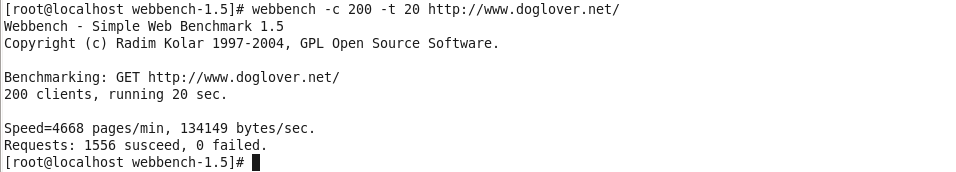
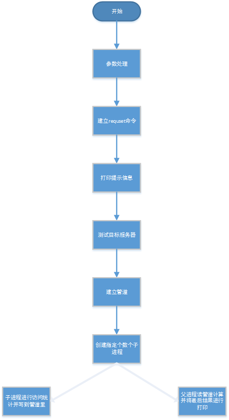

Webbench是有名的网站压力测试工具,它是由Lionbridge公司(http://www.lionbridge.com)开发.它的帮助文件和文档请到:www.webbench.com上查看.

Webbech能测试处在相同硬件上,不同服务的性能以及不同硬件上同一个服务的运行状况.webBech的标准测试可以向我们展示服务器的两项 内容:每秒钟相应请求数和每秒钟传输数据量.webbench不但能具有便准静态页面的测试能力,还能对动态页面(ASP,PHP,JAVA,CGI)进 行测试的能力.还有就是他支持对含有SSL的安全网站例如电子商务网站进行静态或动态的性能测试.

下载：

    官方网站:http://home.tiscali.cz/~cz210552/webbench.html

安装：

    tar zxvf webbench-1.5.tar.gz

    cd webbench-1.5

    make;make install


使用：

    webbench -c 200 -t 20 http://www.doglover.net/
    其中-c 200 代表200个并发用户进行访问-t 20  即20S，访问的url为http://www.doglover.net/；运行20S之后可以看到如下的结果：



可以根据打印中的信息来判断网站的抗压情况。另外使用 webbench -help  可以获得更多的使用信息。

源码分析：

> 整个webbench工程一共有两个C文件：socket.c和webbench.c。具体的分析如下：

socket.c

```
/* $Id: socket.c 1.1 1995/01/01 07:11:14 cthuang Exp $
 *
 * This module has been modified by Radim Kolar for OS/2 emx
 */


/***********************************************************************
  module:       socket.c
  program:      popclient
  SCCS ID:      @(#)socket.c    1.5  4/1/94
  programmer:   Virginia Tech Computing Center
  compiler:     DEC RISC C compiler (Ultrix 4.1)
  environment:  DEC Ultrix 4.3 
  description:  UNIX sockets code.
 ***********************************************************************/
 
#include <sys/types.h>
#include <sys/socket.h>
#include <fcntl.h>
#include <netinet/in.h>
#include <arpa/inet.h>
#include <netdb.h>
#include <sys/time.h>
#include <string.h>
#include <unistd.h>
#include <stdio.h>
#include <stdlib.h>
#include <stdarg.h>


int Socket(const char *host, int clientPort)
{
    int sock;
    unsigned long inaddr;
    struct sockaddr_in ad;
    struct hostent *hp;
    //获取host
    memset(&ad, 0, sizeof(ad));
    ad.sin_family = AF_INET;


    inaddr = inet_addr(host);
    if (inaddr != INADDR_NONE)
        memcpy(&ad.sin_addr, &inaddr, sizeof(inaddr));
    else
    {
        hp = gethostbyname(host);
        if (hp == NULL)
            return -1;
        memcpy(&ad.sin_addr, hp->h_addr, hp->h_length);
    }
    ad.sin_port = htons(clientPort);
    //socket建立
    sock = socket(AF_INET, SOCK_STREAM, 0);
    if (sock < 0)
        return sock;
	//连接
    if (connect(sock, (struct sockaddr *)&ad, sizeof(ad)) < 0)
        return -1;
    return sock;
}
```
    
webbench.c

```
/*
 * (C) Radim Kolar 1997-2004
 * This is free software, see GNU Public License version 2 for
 * details.
 *
 * Simple forking WWW Server benchmark:
 *
 * Usage:
 *   webbench --help
 *
 * Return codes:
 *    0 - sucess
 *    1 - benchmark failed (server is not on-line)
 *    2 - bad param
 *    3 - internal error, fork failed
 * 
 */ 
#include "socket.c"
//这里只有本文件用到了socket.c文件，所以可以这样包含进来
#include <unistd.h>
#include <sys/param.h>
#include <rpc/types.h>
#include <getopt.h>
#include <strings.h>
#include <time.h>
#include <signal.h>


/* values */
volatile int timerexpired=0;
int speed=0;
int failed=0;
int bytes=0;
/* globals */
int http10=1; /* 0 - http/0.9, 1 - http/1.0, 2 - http/1.1 */
/* Allow: GET, HEAD, OPTIONS, TRACE */
#define METHOD_GET 0
#define METHOD_HEAD 1
#define METHOD_OPTIONS 2
#define METHOD_TRACE 3
#define PROGRAM_VERSION "1.5"
int method=METHOD_GET;
int clients=1;
int force=0;
int force_reload=0;
int proxyport=80;
char *proxyhost=NULL;
int benchtime=30;
/* internal */
int mypipe[2];
char host[MAXHOSTNAMELEN];
#define REQUEST_SIZE 2048
char request[REQUEST_SIZE];


static const struct option long_options[]=
{
 {"force",no_argument,&force,1},
 {"reload",no_argument,&force_reload,1},
 {"time",required_argument,NULL,'t'},
 {"help",no_argument,NULL,'?'},
 {"http09",no_argument,NULL,'9'},
 {"http10",no_argument,NULL,'1'},
 {"http11",no_argument,NULL,'2'},
 {"get",no_argument,&method,METHOD_GET},
 {"head",no_argument,&method,METHOD_HEAD},
 {"options",no_argument,&method,METHOD_OPTIONS},
 {"trace",no_argument,&method,METHOD_TRACE},
 {"version",no_argument,NULL,'V'},
 {"proxy",required_argument,NULL,'p'},
 {"clients",required_argument,NULL,'c'},
 {NULL,0,NULL,0}
};


/* prototypes */
static void benchcore(const char* host,const int port, const char *request);
static int bench(void);
static void build_request(const char *url);


static void alarm_handler(int signal)
{
   timerexpired=1;
}	


static void usage(void)
{//标准错误输出打印下面的字符串，在"" ""中代表一个连续的字符串
   fprintf(stderr,
	"webbench [option]... URL\n"
	"  -f|--force               Don't wait for reply from server.\n"
	"  -r|--reload              Send reload request - Pragma: no-cache.\n"
	"  -t|--time <sec>          Run benchmark for <sec> seconds. Default 30.\n"
	"  -p|--proxy <server:port> Use proxy server for request.\n"
	"  -c|--clients <n>         Run <n> HTTP clients at once. Default one.\n"
	"  -9|--http09              Use HTTP/0.9 style requests.\n"
	"  -1|--http10              Use HTTP/1.0 protocol.\n"
	"  -2|--http11              Use HTTP/1.1 protocol.\n"
	"  --get                    Use GET request method.\n"
	"  --head                   Use HEAD request method.\n"
	"  --options                Use OPTIONS request method.\n"
	"  --trace                  Use TRACE request method.\n"
	"  -?|-h|--help             This information.\n"
	"  -V|--version             Display program version.\n"
	);
};
int main(int argc, char *argv[])
{
 int opt=0;
 int options_index=0;
 char *tmp=NULL;
 //检查参数，参数不对进行用法展示
 if(argc==1)
 {
	  usage();
      return 2;
 } 
//获取传入的命令行参数，根据long_options设置进行返回。optarg和optind为外部变量
 while((opt=getopt_long(argc,argv,"912Vfrt:p:c:?h",long_options,&options_index))!=EOF )
 {//根据解析出的参数进行赋值到变量中进行后续的使用
  switch(opt)
  {
   case  0 : break;
   case 'f': force=1;break;
   case 'r': force_reload=1;break; 
   case '9': http10=0;break;
   case '1': http10=1;break;
   case '2': http10=2;break;
   case 'V': printf(PROGRAM_VERSION"\n");exit(0);
   case 't': benchtime=atoi(optarg);break;	     
   case 'p': 
	     /* proxy server parsing server:port */
	     tmp=strrchr(optarg,':');
	     proxyhost=optarg;
	     if(tmp==NULL)
	     {
		     break;
	     }
	     if(tmp==optarg)
	     {
		     fprintf(stderr,"Error in option --proxy %s: Missing hostname.\n",optarg);
		     return 2;
	     }
	     if(tmp==optarg+strlen(optarg)-1)
	     {
		     fprintf(stderr,"Error in option --proxy %s Port number is missing.\n",optarg);
		     return 2;
	     }
	     *tmp='\0';
	     proxyport=atoi(tmp+1);break;
   case ':':
   case 'h':
   case '?': usage();return 2;break;
   case 'c': clients=atoi(optarg);break;
  }
 }
 //检查参数个数
 if(optind==argc) 
 {
		fprintf(stderr,"webbench: Missing URL!\n");
		usage();
		return 2;
 }
//检查客户并发数和测试时间，并对违法的设置给出默认的值
 if(clients==0) clients=1;
 if(benchtime==0) benchtime=60;
 /* Copyright */
 fprintf(stderr,"Webbench - Simple Web Benchmark "PROGRAM_VERSION"\n"
	 "Copyright (c) Radim Kolar 1997-2004, GPL Open Source Software.\n"
	 );
 //建立requst命令
 build_request(argv[optind]);
 /* print bench info */
 printf("\nBenchmarking: ");
 switch(method)
 {
	 case METHOD_GET:
	 default:
		 printf("GET");break;
	 case METHOD_OPTIONS:
		 printf("OPTIONS");break;
	 case METHOD_HEAD:
		 printf("HEAD");break;
	 case METHOD_TRACE:
		 printf("TRACE");break;
 }
 printf(" %s",argv[optind]);
 switch(http10)
 {
	 case 0: printf(" (using HTTP/0.9)");break;
	 case 2: printf(" (using HTTP/1.1)");break;
 }
 printf("\n");
 if(clients==1) printf("1 client");
 else
   printf("%d clients",clients);


 printf(", running %d sec", benchtime);
 if(force) printf(", early socket close");
 if(proxyhost!=NULL) printf(", via proxy server %s:%d",proxyhost,proxyport);
 if(force_reload) printf(", forcing reload");
 printf(".\n");
 //以上区间为打印的提示信息，下面的主处理
 return bench();
}


void build_request(const char *url)
{
  char tmp[10];
  int i;
//清零
  bzero(host,MAXHOSTNAMELEN);
  bzero(request,REQUEST_SIZE);
//设置版本http
  if(force_reload && proxyhost!=NULL && http10<1) http10=1;
  if(method==METHOD_HEAD && http10<1) http10=1;
  if(method==METHOD_OPTIONS && http10<2) http10=2;
  if(method==METHOD_TRACE && http10<2) http10=2;
//测试方式
  switch(method)
  {
	  default:
	  case METHOD_GET: strcpy(request,"GET");break;
	  case METHOD_HEAD: strcpy(request,"HEAD");break;
	  case METHOD_OPTIONS: strcpy(request,"OPTIONS");break;
	  case METHOD_TRACE: strcpy(request,"TRACE");break;
  }
//拼接requset命令
  strcat(request," ");


  if(NULL==strstr(url,"://"))
  {
	  fprintf(stderr, "\n%s: is not a valid URL.\n",url);
	  exit(2);
  }
  if(strlen(url)>1500)
  {
         fprintf(stderr,"URL is too long.\n");
	 exit(2);
  }
  if(proxyhost==NULL)
	   if (0!=strncasecmp("http://",url,7)) 
	   {
	   		fprintf(stderr,"\nOnly HTTP protocol is directly supported, set --proxy for others.\n");
            exit(2);
       }
  /* protocol/host delimiter */
  i=strstr(url,"://")-url+3;
  /* printf("%d\n",i); */


  if(strchr(url+i,'/')==NULL)
  {
    fprintf(stderr,"\nInvalid URL syntax - hostname don't ends with '/'.\n");
    exit(2);
  }
  if(proxyhost==NULL)
  {
   /* get port from hostname */
   if(index(url+i,':')!=NULL && index(url+i,':')<index(url+i,'/'))
   {
	   strncpy(host,url+i,strchr(url+i,':')-url-i);
	   bzero(tmp,10);
	   strncpy(tmp,index(url+i,':')+1,strchr(url+i,'/')-index(url+i,':')-1);
	   /* printf("tmp=%s\n",tmp); */
	   proxyport=atoi(tmp);
	   if(proxyport==0) proxyport=80;
   } 
   else
   {
     strncpy(host,url+i,strcspn(url+i,"/"));
   }
   // printf("Host=%s\n",host);
   strcat(request+strlen(request),url+i+strcspn(url+i,"/"));
  } 
  else
  {
   // printf("ProxyHost=%s\nProxyPort=%d\n",proxyhost,proxyport);
   strcat(request,url);
  }
  if(http10==1)
	  strcat(request," HTTP/1.0");
  else if (http10==2)
	  strcat(request," HTTP/1.1");
  strcat(request,"\r\n");
  if(http10>0)
	  strcat(request,"User-Agent: WebBench "PROGRAM_VERSION"\r\n");
  if(proxyhost==NULL && http10>0)
  {
	  strcat(request,"Host: ");
	  strcat(request,host);
	  strcat(request,"\r\n");
  }
  if(force_reload && proxyhost!=NULL)
  {
	  strcat(request,"Pragma: no-cache\r\n");
  }
  if(http10>1)
	  strcat(request,"Connection: close\r\n");
  /* add empty line at end */
  if(http10>0) strcat(request,"\r\n"); 
  // printf("Req=%s\n",request);
}


/* vraci system rc error kod */
static int bench(void)
{
  int i,j,k;	
  pid_t pid=0;
  FILE *f;


  /* check avaibility of target server */
  i=Socket(proxyhost==NULL?host:proxyhost,proxyport);
  if(i<0)
  { 
	   fprintf(stderr,"\nConnect to server failed. Aborting benchmark.\n");
	   return 1;
  }
  close(i);
  /* create pipe */
  if(pipe(mypipe))
  {
	  perror("pipe failed.");
	  return 3;
  }


  /* not needed, since we have alarm() in childrens */
  /* wait 4 next system clock tick */
  /*
  cas=time(NULL);
  while(time(NULL)==cas)
        sched_yield();
  */


  /* fork childs */
  for(i=0;i<clients;i++)
  {
	   pid=fork();
	   if(pid <= (pid_t) 0)
	   {
		   /* child process or error*/
	           sleep(1); /* make childs faster */
		   break;
	   }
  }


  if( pid< (pid_t) 0)
  {
          fprintf(stderr,"problems forking worker no. %d\n",i);
	  perror("fork failed.");
	  return 3;
  }


  if(pid== (pid_t) 0)
  {
    /* I am a child */
	//子进程进行
    if(proxyhost==NULL)
      benchcore(host,proxyport,request);
         else
      benchcore(proxyhost,proxyport,request);


         /* write results to pipe */
		 //将得到的信息进行打印到管道里面
	 f=fdopen(mypipe[1],"w");
	 if(f==NULL)
	 {
		 perror("open pipe for writing failed.");
		 return 3;
	 }
	 /* fprintf(stderr,"Child - %d %d\n",speed,failed); */
	 fprintf(f,"%d %d %d\n",speed,failed,bytes);
	 fclose(f);
	 return 0;
  } else
  {
  	//父进程进行统计信息
	  f=fdopen(mypipe[0],"r");
	  if(f==NULL) 
	  {
		  perror("open pipe for reading failed.");
		  return 3;
	  }
	  setvbuf(f,NULL,_IONBF,0);
	  speed=0;
          failed=0;
          bytes=0;


	  while(1)
	  {//读取管道中的值
		  pid=fscanf(f,"%d %d %d",&i,&j,&k);
		  if(pid<2)
          {
               fprintf(stderr,"Some of our childrens died.\n");
               break;
          }
		  speed+=i;
		  failed+=j;
		  bytes+=k;
		  /* fprintf(stderr,"*Knock* %d %d read=%d\n",speed,failed,pid); */
		  if(--clients==0) break;
	  }
	  fclose(f);
//输出统计出的信息
  printf("\nSpeed=%d pages/min, %d bytes/sec.\nRequests: %d susceed, %d failed.\n",
		  (int)((speed+failed)/(benchtime/60.0f)),
		  (int)(bytes/(float)benchtime),
		  speed,
		  failed);
  }
  return i;
}


void benchcore(const char *host,const int port,const char *req)
{
 int rlen;
 char buf[1500];
 int s,i;
 struct sigaction sa;
//设置定时器信号
 /* setup alarm signal handler */
 sa.sa_handler=alarm_handler;
 sa.sa_flags=0;
 if(sigaction(SIGALRM,&sa,NULL))
    exit(3);
 alarm(benchtime);
//在时间段内进行循环的访问request命令和接收回复并进行统计
 rlen=strlen(req);
 nexttry:while(1)
 {
    if(timerexpired)
    {
       if(failed>0)
       {
          /* fprintf(stderr,"Correcting failed by signal\n"); */
          failed--;
       }
       return;
    }
    s=Socket(host,port);                          
    if(s<0) { failed++;continue;} 
    if(rlen!=write(s,req,rlen)) {failed++;close(s);continue;}
    if(http10==0) 
	    if(shutdown(s,1)) { failed++;close(s);continue;}
    if(force==0) 
    {
            /* read all available data from socket */
	    while(1)
	    {
              if(timerexpired) break; 
	      i=read(s,buf,1500);
              /* fprintf(stderr,"%d\n",i); */
	      if(i<0) 
          { 
             failed++;
             close(s);
             goto nexttry;
          }
	       else
		       if(i==0) break;
		       else
			       bytes+=i;
	    }
    }
    if(close(s)) {failed++;continue;}
    speed++;
 }
}
```
    
一个比较见到处理流程示意图，其中忽略了错误处理，只体现了大致的处理过程。

