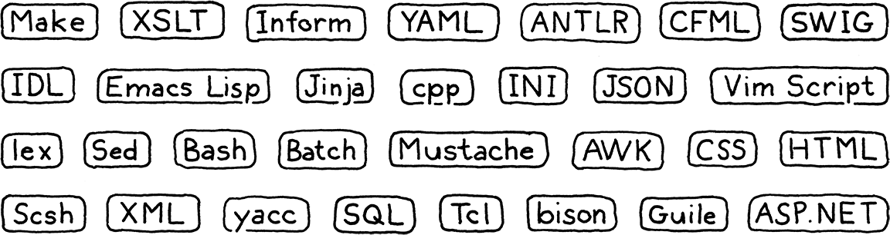

## 简介

    童话的真正意义在于：不是因为它们告诉我们龙存在，而是因为它们告诉我们龙可以被打败。”

                                                                 Neil Gaiman, Coraline

和大家一起开始本次行程我感到非常的激动。这是一本关于实现编程语言解释程序的书。它也是一本关于如何设计一种值得实现的语言的书。这本书是我第一次开始学习语言的时候所希望的，这本书是我用脑子写了近十年的。(对我的朋友和家人，对不起，我这么心不在焉！) 

在这些页面中，我们将一步一步地通过两个完整的解释器来获得一种功能齐全的语言。我假设这是您第一次深入语言之中，所以我将介绍构建完整、可用、快速的语言实现所需的每个概念和代码行。 

为了在一本书中填充两个完整的实现而不使其变成一个门挡，本文在理论上比其他的要轻。当我们构建系统的每一部分时，我将介绍它背后的历史和概念。我会尽量让你熟悉这个术语，这样如果你发现自己在一个充满了PL（编程语言）研究人员的鸡尾酒会上，你会很适合的。(奇怪的是，这种情况我已经多次发现自己。你不会相信他们中有多少人能喝。) 
 
但我们主要是花脑汁来启动和运行语言。这并不是说理论不重要。能够准确而正式地推理语法和语义是学习语言时的一项重要技能。但是，就我个人而言，我通过努力学习得最好。对于我来说，很难翻阅那些充满抽象概念的段落并真正吸收它们。但如果我已经编码了一些东西，运行它，并调试了它，那么我就得到了它。

静态类型系统尤其需要严格的形式推理。对一个类型系统进行黑客攻击与在数学中证明一个定理有着相同的感觉。 

结果证明这不是巧合。上世纪初，哈斯克尔·柯里和威廉·阿尔文·霍华德证明了他们是同一枚硬币的两面：柯里·霍华德同构。 

这是我对你的目标。我想让你对真实的语言是如何生活和呼吸有一个坚实的直觉。我的希望是，当你以后读到其他更理论的书时，那些概念会牢牢地留在你的脑海中，依附在这有形的底物上。


### 1.1 为什么要学这些东西？

每本语言书的每一个引言似乎都有这个部分。我不知道编程语言是什么导致了这种存在主义的怀疑。我不认为鸟类学书籍会为证明它们的存在而担心。他们假设读者喜欢鸟，并且开始移动。 

但是编程语言有点不同。我想，我们中任何人创建一种广泛成功的通用编程语言的可能性都很小，这是真的。世界上广泛使用的语言的设计者即使不安装Pop-Top露营车，也可以安装在大众汽车上。如果加入这个精英群体是学习语言的唯一原因，那将很难证明这一点。幸运的是，事实并非如此。 

#### 1.1.1 到处都是小语种 

对于每一种成功的通用语言，都有上千种成功的利基语言。我们过去称之为“小语言”，但今天术语经济的膨胀导致了“特定于领域的语言”的名称。这些是为特定任务量身定做的pidgins。例如应用程序脚本语言、模板引擎、标记格式和配置文件。


(你可能遇到的一些小语言的随机选择)

几乎每个大型软件项目都需要其中的一小部分。如果可以的话，最好是重用一个现有的，而不是滚动自己的。一旦您考虑到文档、调试程序、编辑器支持、语法突出显示和所有其他特性，那么自己动手就成了一个很高的要求。

但是，当没有适合您需要的现有库时，您仍然有很好的机会发现自己需要创建一个解析器或其他东西。即使有一个可以重用，最终也不可避免地需要对其进行调试和维护，并深入挖掘其内部

#### 1.1.2 语言是很好的练习 

长距离跑步者有时会把重物绑在脚踝上或在空气稀薄的高海拔地区进行训练。当他们稍后释放自己的能量时，新的相对轻松的轻肢和富氧空气使他们能够跑得越来越快。

实现一种语言是对编程技能的真正考验。代码很复杂，性能非常关键。您必须掌握递归、动态数组、树、图和哈希表。您可能至少在日常编程中使用哈希表，但您真正了解它们的程度如何？好吧，在我们从头做起自己的作品之后，我保证你会的。

虽然我打算向您展示编程语言并不像您可能相信的那样令人生畏，但它仍然是一个挑战。站起来，你会成为一个更强大的程序员，在日常工作中如何使用数据结构和算法方面更聪明。

#### 1.1.3 最后一个原因

我很难承认这最后一个原因，因为它离我的心太近了。自从我小时候学会编程，我就觉得语言有点神奇。当我第一次使用基本程序时，一次只使用一个键，我无法想象基本程序本身是如何产生的。 

后来，我大学的朋友们提到他们的编译器课程时所用的敬畏和恐惧的混合足以让我相信语言黑客是不同种类的人。一些巫师授予了进入神秘艺术的特权。

这是一个迷人的形象，但它有一个黑暗的一面。我觉得自己不像个巫师，所以我觉得自己天生就缺少加入阴谋集团所必需的素质。尽管自从我在学校笔记本上涂鸦自己编的关键词后，我就对语言着迷了，但我花了几十年的时间才鼓起勇气去真正地学习它们。那种“神奇”的品质，那种排他性的感觉，把我排除在外。(一个是它的从业者们毫不犹豫地表演。两本关于编程语言的开创性著作的封面上有一条龙和一个巫师。) 

当我终于开始拼凑自己的小口译员时，我很快就明白了，当然，根本就没有魔法。它只是代码，而黑客语言的人只是人。

有一些技术是您在语言之外不经常遇到的，有些部分有点困难。但不会比你克服的其他障碍更困难。我的希望是，如果你感到语言的威胁，这本书帮助你克服恐惧，也许我会让你比以前勇敢一点。 

谁知道呢，也许你会成为下一个伟大的语言。必须有人来。 

### 1.2 这本书是如何组织的

这本书分成三部分。你现在正在读第一本。这是几章让你导向，教你一些黑客使用的行话语言，并向你介绍我们将要实现的语言lox。

其他两个部分分别构建一个完整的lox解释器。在这些部分中，每一章的结构都是相同的。每个人都有一个单一的语言特性，教你它背后的概念，并通过它的一个实现。

对我来说，这是一次很好的尝试和错误，但我设法将两个口译员分成章节大小的部分，以便每个部分都建立在以前的部分之上。从第一章开始，你将有一个可以运行和播放的程序。每过一章，它就会变得越来越全面，直到你最终拥有一门完整的语言。

除了丰富多彩的英语散文外，各章还有一些其他令人愉快的方面：

#### 1.2.1 代码

我们要做解释器，所以这本书包含真正的代码。所需的每一行代码都包含在内，并且每一个代码片段都告诉您在不断增长的实现中插入它的位置。

许多其他语言书籍和语言实现使用诸如lex和yacc、“编译器编译器”之类的工具，从更高级别的描述中自动生成实现的一些源文件。像这样的工具有利弊，一些人可能会在双方都说宗教信仰。（yacc是一个接受语法文件并为编译器生成源文件的工具，所以它有点像一个“编译器”，它输出一个编译器，这就是我们得到术语“编译器编译器”的地方。yacc不是它的第一个同类，这就是为什么它被命名为“yacc”——另一个编译器编译器。另一个后来类似的工具是野牛，它被命名为类似于yacc的“yak”发音的双关语。

如果你发现所有这些小的自我介绍和双关语都很迷人和有趣，你会很适合这里。如果不是，那么，也许语言书呆子的幽默感是后天习得的。 ）

我们不会在这里使用它们。我想确保没有魔法和混乱可以隐藏的黑暗角落，所以我们将用手写下所有的东西。正如您将看到的，它没有听起来那么糟糕，这意味着您将真正理解每一行代码以及两个解释程序是如何工作的。

一本书与“现实世界”有不同的约束，因此这里的编码风格可能并不总是反映出编写可维护生产软件的最佳方式。如果我在省略private或声明全局变量方面显得有点傲慢，请理解我这样做是为了让代码更容易被您看到。这里的页面不如您的IDE宽，而且每个字符都很重要。

而且，代码没有很多注释。这是因为每一行都被几段对上帝诚实的散文所包围。当你写一本书来配合你的计划时，也欢迎你省略评论。否则，你应该比我多用一点。

这本书没有包含编译和运行代码所需的机器。我假设您可以在您选择的IDE中组合一个makefile或一个项目，以便运行代码。

#### 1.2.2 片断 

因为这本书字面上包含了实现所需的每一行代码，所以代码片段非常精确。另外，因为我试图使程序保持在可运行状态，即使它是半实现的，有时我们会添加临时代码，在后面的代码片段中替换。

一个包含所有铃声和口哨的片段如下： 
```
      default:
```
        if (isDigit(c)) {
          number();
        } else {
          Lox.error(line, "Unexpected character.");
        }
```
        break;
```
lox/Scanner.java in scanToken() replace 1 line

在中间，您将在这个片段中添加新代码。它上面或下面可能有一些褪色的行，以显示在现有代码中插入它的位置。还有一个小提示告诉你哪个文件以及它在文件中的位置。如果它说“替换行”，那么在褪色的行之间有一些以前的代码，您需要删除这些代码段并用它替换。

#### 1.2.3 旁白

ASIDES包含传记素描、历史背景、相关主题的参考资料以及其他需要探索的领域的建议。你不需要知道其中的任何内容来理解这本书后面的部分，所以如果你想的话可以跳过它们。我不会评判你，但我可能有点伤心。
（嗯，至少有一些是这样的。他们中的大多数只是愚蠢的笑话和业余绘画。） 

#### 1.2.4 挑战

每章都以一些练习结束。不像教科书中的习题集，这些习题集往往会重复你已经学过的内容，它们能帮助你学到比本章更多的东西。它们迫使你走出被引导的道路，独自探索。他们会让你研究其他语言，找出如何实现特性，或者让你自己动手

击败他们，你会得到更广泛的理解，可能会遇到一些磕碰和擦伤。或者，如果你想呆在旅游巴士舒适的范围内，就跳过它们。这是你的书。

#### 1.2.5 设计笔记 

大多数“编程语言”书籍都是严格的编程语言实现书籍。他们很少讨论如何设计正在实现的语言。实现很有趣，因为它是如此精确地定义的。我们的程序员似乎对黑白、一和零的东西有亲和力。 
（我认识很多语言黑客，他们的职业生涯就是基于这个。将语言规范滑到它们的门下，等待几个月，代码和基准测试结果就会出来。） 

就我个人而言，我认为世界只需要很多Fortran 77的实现。在某种程度上，你会发现自己在设计一种新的语言。一旦你开始玩那个游戏，那么方程中较软、人性化的一面就变得至关重要。诸如哪些功能易于学习、如何平衡创新和熟悉度、什么语法更易读以及对谁而言。（希望这种语言不会将穿孔卡片宽度的假设硬编码到语法中。）

所有这些都深刻地影响了你的新语言的成功。我希望您的语言能够成功，所以在一些章节中，我以“设计说明”结尾，这是一篇关于编程语言人性方面的小文章。我不是这方面的专家——我不知道是否有人真的是这样，所以拿着这些加一大口盐。我的主要目标是让他们成为更美味的思考食物。

### 1.3 第一个解释器

我们将用Java编写我们的第一个解释器JOLX。重点是概念。我们将编写能够正确实现语言语义的最简单、最干净的代码。这将使我们对基本的技术感到满意，并使我们更好地理解语言的行为方式。

Java是一种很好的语言。它的水平足够高，我们不会被复杂的实现细节所压倒，但它仍然相当明确。与脚本语言不同，在引擎盖下的魔力往往更小，而且您可以使用静态类型来查看正在使用的数据结构。 

我之所以选择它，是因为它是一种面向对象的语言。这种模式在90年代席卷了编程界，现在是数百万程序员的主流思维方式。很有可能你已经习惯了将事物组织成类和方法，所以我们会让你保持在那个舒适的区域。

尽管学术语言人士有时会看不起面向对象的语言，但事实上，它们甚至被广泛用于语言工作。GCC和LLVM都是用C++编写的，就像大多数JavaScript虚拟机一样。面向对象语言无处不在，一种语言的工具和编译器通常用同一种语言编写。

（编译器以一种语言读取文件，并将其转换为另一种语言的文件。您可以用任何语言实现编译器，包括它编译的同一种语言，这是一个称为“自宿主”的过程。）

（您还不能用自己编译它，但是如果您的语言有另一个用其他语言编写的编译器，您可以用它编译一次编译器。现在，您可以使用自己的编译器的编译版本来编译自己的未来版本，并且可以放弃从另一个编译器编译的原始版本。这被称为“引导”，从图像拉自己由自己的引导。）

最后，Java非常流行。这意味着你很有可能已经知道了这一点，所以你在书中学习的机会就更少了。如果你对Java不太熟悉，不要惊慌失措。我试着坚持它的一个相当小的子集。我使用JAVA 7的菱形操作符使事情变得更简洁，但就“高级”特性而言，这就是它。如果你知道另一种面向对象的语言，比如C语言或C++，你很可能混在一起。

到第二部分结束时，我们将有一个简单、易读的实现。我们不会有快的。它还依赖Java虚拟机的运行时设备，但我们想了解Java本身是如何实现这些功能的。

### 1.4 第二个解释器

所以在下一部分中，我们将重新开始，但这次在C.C中是理解实现如何真正工作的完美语言，一直到内存中的字节和流经CPU的代码。

我们使用C的一个重要原因是，我可以向您展示C特别擅长的东西，但这确实意味着您需要非常方便地使用它。你不必成为丹尼斯·里奇的化身，但你也不应该被指尖吓到。

如果你还没到那里，拿起一本关于C的入门书，仔细读一遍，做完之后再回来。作为回报，你将从这本书中走出来，成为一个更强大的C程序员。这很有用，因为有多少语言实现是用C语言编写的：Lua、Cpython和Ruby的MRI等等。

在我们的C解释器Culx中，我们被迫为自己实现了Java免费给我们的所有东西。我们将编写自己的动态数组和哈希表。我们将决定如何在内存中表示对象，并构建一个垃圾收集器来回收它。

（我把这个名字念成“sea-locks”，但你可以说它是“clocks”，甚至是“clochs”，在这里，你可以像希腊人一样念“x”，如果它能让你快乐的话。）

我们的Java实现关注的是正确的。既然我们已经把它放下了，我们也要快点了。我们的C解释器将包含一个编译器，它将代码转换成一个有效的字节码表示（不用担心，我很快就会理解这意味着什么），然后执行。这与Lua、Python、Ruby、PHP和许多其他成功语言的实现所使用的技术相同。

(你认为这只是一本口译书吗？这也是一本编译书。两个换一个！)

我们甚至会尝试我们的手在基准和优化。到最后，我们将拥有一个健壮、准确、快速的语言解释程序，能够跟上其他专业级的实现。一本书和几千行代码也不错。

### Challenges

```
1、在我拼凑起来的这个小系统中，至少使用了六种特定于领域的语言来编写和出版这本书。它们是什么？

2、得到一个“你好，世界！“用Java编写和运行程序”。设置您需要的任何生成文件或IDE项目以使其正常工作。如果您有一个调试器，请熟悉它，并在程序运行时逐步执行它。

3、对C执行相同的操作。要使用指针进行一些实践，请定义堆分配字符串的双重链接列表。编写函数以插入、查找和删除其中的项。测试它们。
```

### Design Note: What's in a Name?

写这本书最困难的挑战之一是为它实现的语言取一个名字。在我找到一个有效的候选人之前，我浏览了几页。正如您第一天开始构建自己的语言时会发现的，命名非常困难。好的名字符合以下几个标准：

```
1、它没被其他人使用用。如果你不小心踩到别人的名字，你可能会遇到各种各样的麻烦，法律和社会。

2、它很容易发音。如果一切顺利，成群结队的人会说出并写下你的语言名称。任何超过几个音节或几个字母的东西都会使他们恼火不已。

3、它足够清晰，可以搜索。人们会通过谷歌搜索你的语言名称来查找文档，所以你需要一个非常罕见的词，大多数结果都指向你的文档。不过，随着如今大多数搜索引擎的人工智能数量不断增加，这已经不是一个问题了。不过，如果你把你的语言命名为“for”，你就不会对你的用户有任何帮助。

4、它在许多文化中没有负面的含义。这很难防范，但值得考虑。尼姆罗德的设计者最终把他的语言改名为“尼姆”，因为太多人只记得兔八哥用“尼姆罗德”来侮辱他。 

```

如果你潜在的名字能通过这个挑战，那就保留它。不要绞尽脑汁想找到一个能抓住你语言精髓的称谓。如果说世界上其他成功语言的名字教会了我们什么，那就是名字无关紧要。你所需要的只是一个相当独特的代币。

