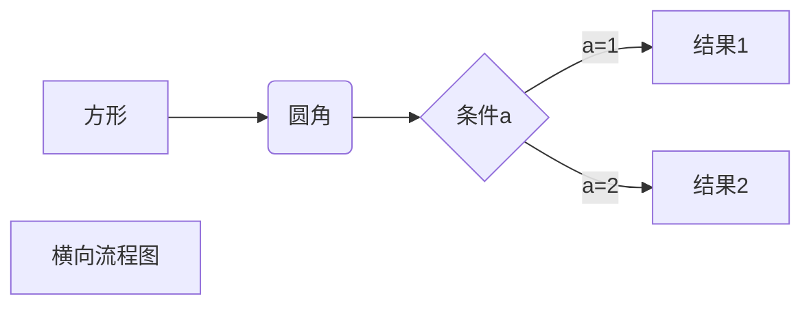
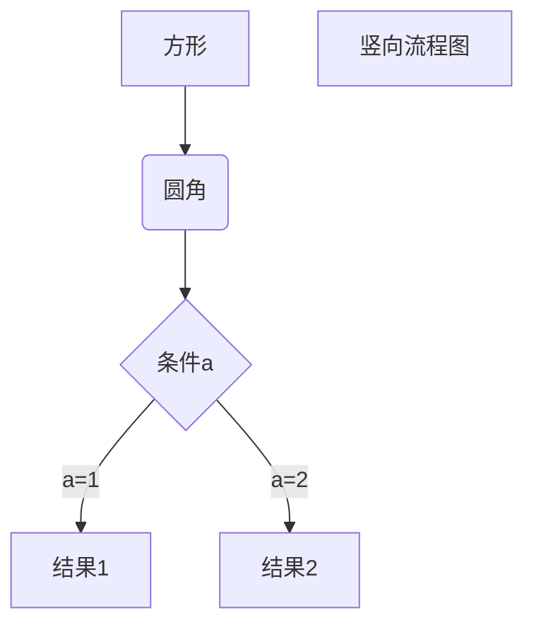
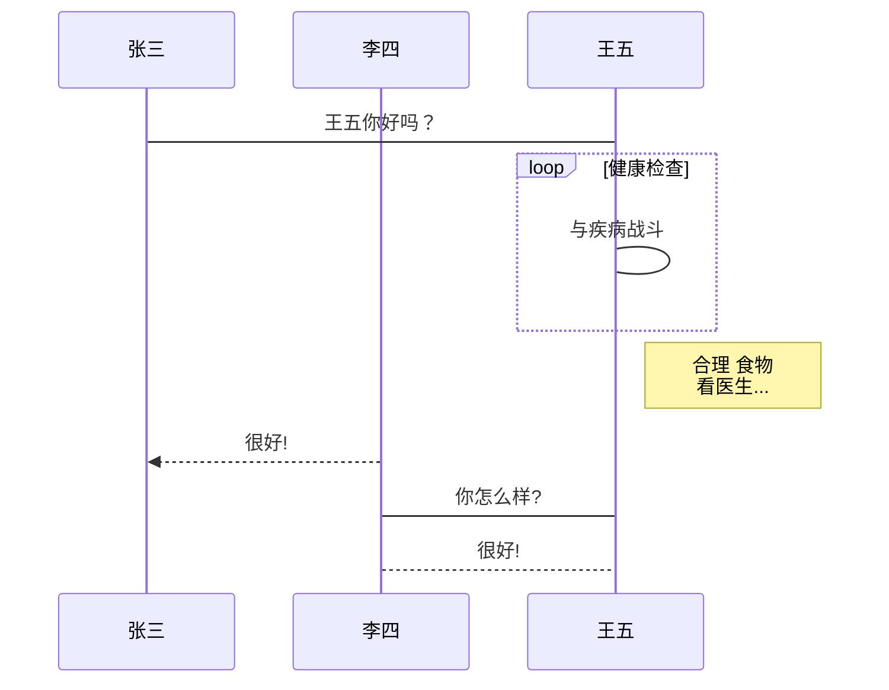
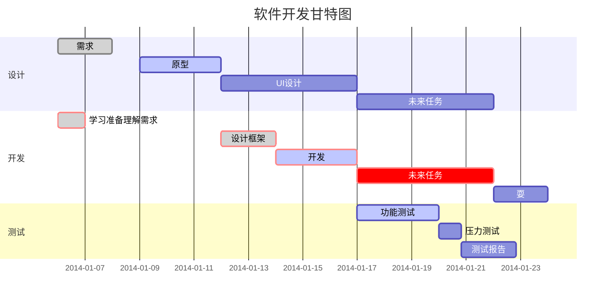

<!-- START doctoc generated TOC please keep comment here to allow auto update -->
<!-- DON'T EDIT THIS SECTION, INSTEAD RE-RUN doctoc TO UPDATE -->
**Table of Contents**  *generated with [DocToc](https://github.com/thlorenz/doctoc)*

- [Markdown](#markdown)
  - [Markdown 简介](#markdown-%E7%AE%80%E4%BB%8B)
  - [Markdown 应用](#markdown-%E5%BA%94%E7%94%A8)
  - [编辑器](#%E7%BC%96%E8%BE%91%E5%99%A8)
  - [有用的书籍](#%E6%9C%89%E7%94%A8%E7%9A%84%E4%B9%A6%E7%B1%8D)
  - [Markdown 标题](#markdown-%E6%A0%87%E9%A2%98)
    - [使用 = 和 - 标记一级和二级标题](#%E4%BD%BF%E7%94%A8--%E5%92%8C---%E6%A0%87%E8%AE%B0%E4%B8%80%E7%BA%A7%E5%92%8C%E4%BA%8C%E7%BA%A7%E6%A0%87%E9%A2%98)
    - [使用 # 号标记](#%E4%BD%BF%E7%94%A8--%E5%8F%B7%E6%A0%87%E8%AE%B0)
  - [Markdown 段落格式](#markdown-%E6%AE%B5%E8%90%BD%E6%A0%BC%E5%BC%8F)
    - [Markdown 段落](#markdown-%E6%AE%B5%E8%90%BD)
    - [分隔线](#%E5%88%86%E9%9A%94%E7%BA%BF)
    - [删除线](#%E5%88%A0%E9%99%A4%E7%BA%BF)
    - [下划线](#%E4%B8%8B%E5%88%92%E7%BA%BF)
    - [脚注](#%E8%84%9A%E6%B3%A8)
  - [Markdown 列表](#markdown-%E5%88%97%E8%A1%A8)
    - [列表嵌套](#%E5%88%97%E8%A1%A8%E5%B5%8C%E5%A5%97)
  - [Markdown 区块](#markdown-%E5%8C%BA%E5%9D%97)
    - [区块中使用列表](#%E5%8C%BA%E5%9D%97%E4%B8%AD%E4%BD%BF%E7%94%A8%E5%88%97%E8%A1%A8)
    - [列表中使用区块](#%E5%88%97%E8%A1%A8%E4%B8%AD%E4%BD%BF%E7%94%A8%E5%8C%BA%E5%9D%97)
  - [Markdown 代码](#markdown-%E4%BB%A3%E7%A0%81)
    - [代码区块](#%E4%BB%A3%E7%A0%81%E5%8C%BA%E5%9D%97)
  - [Markdown 链接](#markdown-%E9%93%BE%E6%8E%A5)
    - [高级链接](#%E9%AB%98%E7%BA%A7%E9%93%BE%E6%8E%A5)
  - [Markdown 图片](#markdown-%E5%9B%BE%E7%89%87)
  - [Markdown 表格](#markdown-%E8%A1%A8%E6%A0%BC)
  - [Markdown 高级技巧](#markdown-%E9%AB%98%E7%BA%A7%E6%8A%80%E5%B7%A7)
    - [支持的 HTML 元素](#%E6%94%AF%E6%8C%81%E7%9A%84-html-%E5%85%83%E7%B4%A0)
    - [转义](#%E8%BD%AC%E4%B9%89)
    - [公式](#%E5%85%AC%E5%BC%8F)
    - [画流程图、时序图(顺序图)、甘特图](#%E7%94%BB%E6%B5%81%E7%A8%8B%E5%9B%BE%E6%97%B6%E5%BA%8F%E5%9B%BE%E9%A1%BA%E5%BA%8F%E5%9B%BE%E7%94%98%E7%89%B9%E5%9B%BE)
      - [横向流程图源码格式：](#%E6%A8%AA%E5%90%91%E6%B5%81%E7%A8%8B%E5%9B%BE%E6%BA%90%E7%A0%81%E6%A0%BC%E5%BC%8F)
      - [竖向流程图源码格式：](#%E7%AB%96%E5%90%91%E6%B5%81%E7%A8%8B%E5%9B%BE%E6%BA%90%E7%A0%81%E6%A0%BC%E5%BC%8F)
      - [标准流程图源码格式：](#%E6%A0%87%E5%87%86%E6%B5%81%E7%A8%8B%E5%9B%BE%E6%BA%90%E7%A0%81%E6%A0%BC%E5%BC%8F)
      - [标准流程图源码格式（横向）：](#%E6%A0%87%E5%87%86%E6%B5%81%E7%A8%8B%E5%9B%BE%E6%BA%90%E7%A0%81%E6%A0%BC%E5%BC%8F%E6%A8%AA%E5%90%91)
      - [UML时序图源码样例：](#uml%E6%97%B6%E5%BA%8F%E5%9B%BE%E6%BA%90%E7%A0%81%E6%A0%B7%E4%BE%8B)
      - [UML时序图源码复杂样例：](#uml%E6%97%B6%E5%BA%8F%E5%9B%BE%E6%BA%90%E7%A0%81%E5%A4%8D%E6%9D%82%E6%A0%B7%E4%BE%8B)
      - [UML标准时序图样例：](#uml%E6%A0%87%E5%87%86%E6%97%B6%E5%BA%8F%E5%9B%BE%E6%A0%B7%E4%BE%8B)
      - [甘特图样例：](#%E7%94%98%E7%89%B9%E5%9B%BE%E6%A0%B7%E4%BE%8B)
  - [目录自动生成](#%E7%9B%AE%E5%BD%95%E8%87%AA%E5%8A%A8%E7%94%9F%E6%88%90)

<!-- END doctoc generated TOC please keep comment here to allow auto update -->

# Markdown 
## Markdown 简介
+ Markdown 是一种轻量级标记语言，它允许人们使用易读易写的纯文本格式编写文档。+ 

+ Markdown 语言在 2004 由约翰·格鲁伯（英语：John Gruber）创建。+ 

+ Markdown 编写的文档可以导出 HTML 、Word、图像、PDF、Epub 等多种格式的文档。+ 

+ Markdown 编写的文档后缀为 .md, .markdown。+ 

## Markdown 应用
　　Markdown 能被使用来撰写电子书，如：Gitbook。
 
　　当前许多网站都广泛使用 Markdown 来撰写帮助文档或是用于论坛上发表消息。例如：GitHub、简书、reddit、Diaspora、Stack Exchange、OpenStreetMap 、SourceForge等。

## 编辑器

　　本教程将使用 Typora 编辑器来讲解 Markdown 的语法，Typora 支持 MacOS 、Windows、Linux 平台，且包含多种主题，编辑后直接渲染出效果。

　　支持导出HTML、PDF、Word、图片等多种类型文件。

　　Typora 官网：https://typora.io/

　　你也可以使用我们的在线编辑器来测试：https://c.runoob.com/front-end/712。

## 有用的书籍
   
   《了不起的Markdown》：

## Markdown 标题
Markdown 标题有两种格式。

### 使用 = 和 - 标记一级和二级标题
= 和 - 标记语法格式如下：
```
我展示的是一级标题
=================

我展示的是二级标题
-----------------
```
### 使用 # 号标记

使用 # 号可表示 1-6 级标题，一级标题对应一个 # 号，二级标题对应两个 # 号，以此类推。
```
# 一级标题
## 二级标题
### 三级标题
#### 四级标题
##### 五级标题
###### 六级标题
```
## Markdown 段落格式
### Markdown 段落
Markdown 段落没有特殊的格式，直接编写文字就好，段落的换行是使用两个以上空格加上回车。
###　自体
Markdown 可以使用以下几种字体：
```
*斜体文本*
_斜体文本_
**粗体文本**
__粗体文本__
***粗斜体文本***
___粗斜体文本___
```
### 分隔线
　　你可以在一行中用三个以上的星号、减号、底线来建立一个分隔线，行内不能有其他东西。你也可以在星号或是减号中间插入空格。下面每种写法都可以建立分隔线：
```
***

* * *

*****

- - -

----------
```
### 删除线
如果段落上的文字要添加删除线，只需要在文字的两端加上两个波浪线 ~~ 即可，实例如下：
```
RUNOOB.COM
GOOGLE.COM
~~BAIDU.COM~~
```

### 下划线
下划线可以通过 HTML 的 < u > 标签来实现
```
<u>带下划线文本</u>
```

### 脚注
脚注是对文本的补充说明。

Markdown 脚注的格式如下:

```
[^要注明的文本]
```

以下实例演示了脚注的用法：

```
创建脚注格式类似这样 [^RUNOOB]。

[^RUNOOB]: 菜鸟教程 -- 学的不仅是技术，更是梦想！！！
```

## Markdown 列表 

Markdown 支持有序列表和无序列表。

无序列表使用星号(*)、加号(+)或是减号(-)作为列表标记，这些标记后面要添加一个空格，然后再填写内容：
```
* 第一项
* 第二项
* 第三项

+ 第一项
+ 第二项
+ 第三项


- 第一项
- 第二项
- 第三项
```

有序列表使用数字并加上 . 号来表示，如：
```
1. 第一项
2. 第二项
3. 第三项
```

### 列表嵌套

列表嵌套只需在子列表中的选项前面添加四个空格即可：
```
1. 第一项：
    - 第一项嵌套的第一个元素
    - 第一项嵌套的第二个元素
2. 第二项：
    - 第二项嵌套的第一个元素
    - 第二项嵌套的第二个元素
```

## Markdown 区块 
Markdown 区块引用是在段落开头使用 > 符号 ，然后后面紧跟一个空格符号：

```
> 区块引用
> 菜鸟教程
> 学的不仅是技术更是梦想
```

另外区块是可以嵌套的，一个 > 符号是最外层，两个 > 符号是第一层嵌套，以此类推：
```
> 最外层
> > 第一层嵌套
> > > 第二层嵌套
```

### 区块中使用列表
区块中使用列表实例如下：
```
> 区块中使用列表
> 1. 第一项
> 2. 第二项
> + 第一项
> + 第二项
> + 第三项
```


### 列表中使用区块

如果要在列表项目内放进区块，那么就需要在 > 前添加四个空格的缩进。

区块中使用列表实例如下：
```
* 第一项
    > 菜鸟教程
    > 学的不仅是技术更是梦想
* 第二项
```

## Markdown 代码
   
如果是段落上的一个函数或片段的代码可以用反引号把它包起来，例如：
`pirnt`函数

### 代码区块

代码区块使用 4 个空格或者一个制表符（Tab 键）。

    this is a demo
你也可以用 ``` 包裹一段代码，并指定一种语言（也可以不指定）：

## Markdown 链接
链接使用方法如下：
```
[链接名称](链接地址)

或者

<链接地址>
```
例如：

这是一个链接 [菜鸟教程](https://www.runoob.com)

直接使用链接地址：<https://www.runoob.com>

### 高级链接

我们可以通过变量来设置一个链接，变量赋值在文档末尾进行：

这个链接用 1 作为网址变量 [Google][1]
这个链接用 runoob 作为网址变量 [Runoob][runoob]
然后在文档的结尾为变量赋值（网址）

  [1]: http://www.google.com/
  [runoob]: http://www.runoob.com/

## Markdown 图片 

Markdown 图片语法格式如下：

```


```

+ 开头一个感叹号 !
+ 接着一个方括号，里面放上图片的替代文字
+ 接着一个普通括号，里面放上图片的网址，最后还可以用引号包住并加上选择性的 'title' 属性的文字。

使用实例：


当然，你也可以像网址那样对图片网址使用变量:

这个链接用 1 作为网址变量 [RUNOOB][1].
然后在文档的结尾为变量赋值（网址）

[1]: http://static.runoob.com/images/runoob-logo.png

Markdown 还没有办法指定图片的高度与宽度，如果你需要的话，你可以使用普通的  标签。


## Markdown 表格
Markdown 制作表格使用 | 来分隔不同的单元格，使用 - 来分隔表头和其他行。

语法格式如下：
```
|  表头   | 表头  |
|  ----  | ----  |
| 单元格  | 单元格 |
| 单元格  | 单元格 |
```
对齐方式

我们可以设置表格的对齐方式：
```
-: 设置内容和标题栏居右对齐。
:- 设置内容和标题栏居左对齐。
:-: 设置内容和标题栏居中对齐。
```
| 左对齐 | 右对齐 | 居中对齐 |
| :-----| ----: | :----: |
| 单元格 | 单元格 | 单元格 |
| 单元格 | 单元格 | 单元格 |
    
## Markdown 高级技巧     

### 支持的 HTML 元素

不在 Markdown 涵盖范围之内的标签，都可以直接在文档里面用 HTML 撰写。
```
目前支持的 HTML 元素有：<kbd> <b> <i> <em> <sup> <sub> <br>等 ，如：
```
使用 <kbd>Ctrl</kbd>+<kbd>Alt</kbd>+<kbd>Del</kbd> 重启电脑

### 转义

Markdown 使用了很多特殊符号来表示特定的意义，如果需要显示特定的符号则需要使用转义字符，Markdown 使用反斜杠转义特殊字符：

**文本加粗**

\*\* 正常显示星号 \*\*


Markdown 支持以下这些符号前面加上反斜杠来帮助插入普通的符号：

```
\   反斜线
`   反引号
*   星号
_   下划线
{}  花括号
[]  方括号
()  小括号
#   井字号
+   加号
-   减号
.   英文句点
!   感叹号
```

### 公式

当你需要在编辑器中插入数学公式时，可以使用两个美元符 $$ 包裹 TeX 或 LaTeX 格式的数学公式来实现。提交后，问答和文章页会根据需要加载 Mathjax 对数学公式进行渲染。如：

```
$$
\mathbf{V}_1 \times \mathbf{V}_2 =  \begin{vmatrix} 
\mathbf{i} & \mathbf{j} & \mathbf{k} \\
\frac{\partial X}{\partial u} &  \frac{\partial Y}{\partial u} & 0 \\
\frac{\partial X}{\partial v} &  \frac{\partial Y}{\partial v} & 0 \\
\end{vmatrix}
${$tep1}{\style{visibility:hidden}{(x+1)(x+1)}}
$$
```

### 画流程图、时序图(顺序图)、甘特图

#### 横向流程图源码格式：

#### 竖向流程图源码格式：



#### 标准流程图源码格式：

```flow
st=>start: 开始框
op=>operation: 处理框
cond=>condition: 判断框(是或否?)
sub1=>subroutine: 子流程
io=>inputoutput: 输入输出框
e=>end: 结束框
st->op->cond
cond(yes)->io->e
cond(no)->sub1(right)->op
```

#### 标准流程图源码格式（横向）：

```flow
st=>start: 开始框
op=>operation: 处理框
cond=>condition: 判断框(是或否?)
sub1=>subroutine: 子流程
io=>inputoutput: 输入输出框
e=>end: 结束框
st(right)->op(right)->cond
cond(yes)->io(bottom)->e
cond(no)->sub1(right)->op
```

#### UML时序图源码样例：

```sequence
对象A->对象B: 对象B你好吗?（请求）
Note right of 对象B: 对象B的描述
Note left of 对象A: 对象A的描述(提示)
对象B-->对象A: 我很好(响应)
对象A->对象B: 你真的好吗？
```

#### UML时序图源码复杂样例：

```sequence
Title: 标题：复杂使用
对象A->对象B: 对象B你好吗?（请求）
Note right of 对象B: 对象B的描述
Note left of 对象A: 对象A的描述(提示)
对象B-->对象A: 我很好(响应)
对象B->小三: 你好吗
小三-->>对象A: 对象B找我了
对象A->对象B: 你真的好吗？
Note over 小三,对象B: 我们是朋友
participant C
Note right of C: 没人陪我玩
```

#### UML标准时序图样例：



#### 甘特图样例：



## 目录自动生成
全局安装doctoc插件
```
npm i doctoc -g //install 简写 i
```
假如你的markdown文件在work/demo.md文件下，只需要cd work 切换到当前文件目录下，执行doctoc demo.md文件，即可在文档中自动生成目录。

有可能出现如下错误：
```
/usr/bin/env: ‘node’: No such file or directory
```
通过执行如下指令进行解决：
```
sudo ln -s /usr/bin/nodejs /usr/bin/node
```


