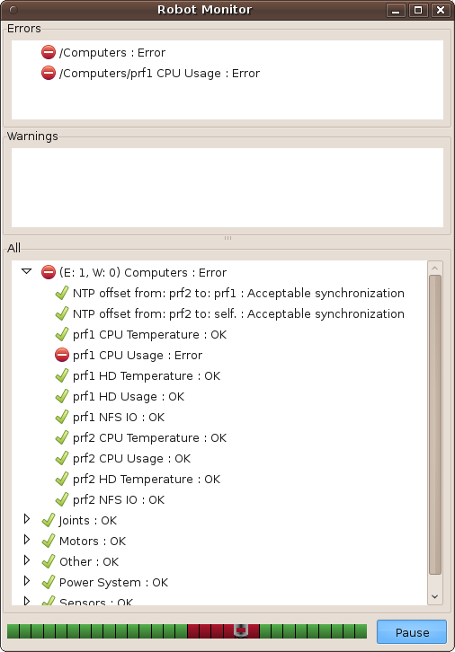

本教程将以PR2为例，帮助您设置和配置诊断聚合器。可以为机器人或机器人类型配置聚合器，以便对诊断进行基本分析。

## 诊断聚合器基础

diagnostics _aggregator包包含用于收集、分类和分析机器人诊断数据的工具。Aggregator类订阅/diagnostics主题的原始数据，并以1Hz的频率发布/diagnostics s_agg。为了处理数据，聚合器在启动时加载“诊断分析器”。这些分析程序可以检查任何数据项，并输出经过处理的诊断数据。

为了保持简单，我们将只使用diagnostics stic_aggregator::GenericAnalyzer和diagnostics stic_aggregator::AnalyzerGroup analyzer类型，它们都在diagnostics stic_aggregator包中。对GenericAnalyzer有一些了解是很有用的，所以如果您有问题，可以查看使用GenericAnalyzer的教程。

我们将经历为PR2设置诊断聚合器(aggregator_node)的过程。我们将把诊断数据分成不同的类型，并设置分析程序来对原始数据进行分类。我们可以使用原始数据的包文件和robot_monitor来测试这一点。

## 查看原始诊断

首先，我们可以从PR2查看原始数据。我们可以获取一个记录诊断数据的包文件，或者订阅一个实际的机器人。要查看它，请使用runtime_monitor。所有原始诊断信息都作为一个diagnostics _msgs/ diagnostics array主题发布在/diagnostics上。

查看PR2上的原始诊断数据，我们可以看到我们有广泛的类别:

* EtherCAT devices (motors)
* Joints
* Computers
* Power System
* Sensors and Drivers
   * Hokuyos
   * IMU
   * Forearm/Dual Stereo Camera
   * Prosilica
   * Joystick 

分析诊断的最简单方法是简单地将所有内容分组到类别中。我们将为上面的每个组或子组设置一个分析器。

## 设置聚合器

要配置aggregator_node，我们首先将所有EtherCAT设备分组在一起。这些设备是PR2执行器，加上LED投影仪板和EtherCAT集线器。

为了让aggregator_node加载分析程序，我们需要在aggregator_node的私有参数空间中设置分析程序。创建一个YAML文件来存储参数。您可以在任何包中实现它，或者只使用现有的“diagnostics stic_aggregator/demo/pr2_analyzers.yaml”。这个配置文件将加载到aggregator_node的私有参数名称空间中。
```
pub_rate: 1.0 # Optional
base_path: '' # Optional, prepended to all diagnostic output
analyzers:
  motors:
    type: GenericAnalyzer
    path: Motors
    startswith: 'EtherCAT'
```
在analyzers名称空间中，我们在motors名称空间中创建了第一个分析器。让我们看看电机下的每个参数。

* **type**: 这是强制性的所有分析仪。它告诉aggregator_node要加载哪个插件类。

* **path**: 这个GenericAnalyzer的所有输出都使用这个名称。(例如:“EtherCAT设备(head_pan_motor)”)-> "电机/EtherCAT设备(head_pan_motor)"

* **startswith**: 这告诉GenericAnalyzer分析任何以“EtherCAT”开头的组件。有关详细信息，请参阅使用GenericAnalyzer的教程。 

### 使用AnalyzerGroup

当我们将诊断分类时，传感器被归入“传感器”之下，但属于不同的子类别。要使用aggregator_node中的子类别，我们使用AnalyzerGroup。

在上面相同的YAML文件中，添加:

```
sensors:
    type: AnalyzerGroup
    path: Sensors
    analyzers:
      base_hk:
        type: GenericAnalyzer
        path: Base Hokuyo
        timeout: 5.0
        find_and_remove_prefix: base_hokuyo_node
        num_items: 3
      tilt_hk:
        type: GenericAnalyzer
        path: Tilt Hokuyo
        timeout: 5.0
        find_and_remove_prefix: tilt_hokuyo_node
        num_items: 3
      imu:
        type: GenericAnalyzer
        path: IMU
        timeout: 5.0
        find_and_remove_prefix: imu_node
        num_items: 3
```

这将建立一个覆盖“传感器”的分析组，并将Hokuyo's和IMU归入子类别。输入消息“imu_node: Connection Status”将变为“sensor /IMU/Connection Status”，并在机器人监视器中向下两层。

AnalyzerGroup将为其analyzers名称空间中指定的任何分析器初始化“子分析器”。

### 添加剩余的分析器

要向aggregator_node添加更多分析程序，请将参数添加到YAML设置文件。
 
```
  computers:
    type: GenericAnalyzer
    path: Computers
    contains: [
      'HD Temp',
      'CPU Usage',
      'CPU Temperature',
      'HD Usage',
      'NFS']
  joints:
    type: GenericAnalyzer
    path: Joints
    startswith: 'Joint'
  power:
    type: GenericAnalyzer
    path: 'Power System'
    timeout: 5.0
    startswith: [
      'Smart Battery',
      'Power board']
    expected: [
      'IBPS 1',
      'IBPS 2',
      'IBPS 3',
      'IBPS 0']
```
这将为分析仪“填写”电源系统、计算机和关节的类别。

## 启动聚合器

完成上面的YAML文件后，将其添加到roslaunch文件中，以便它加载到aggregator_node的名称空间中。

你的启动文件应该是这样的:

```
<launch>
  <node pkg="diagnostic_aggregator" type="aggregator_node"
        name="diagnostic_aggregator" >
    <!-- Load the file you made above -->
    <rosparam command="load" 
              file="$(find my_robot_package)/analyzers.yaml" />
  </node>
</launch>
```

将此启动文件保存为“aggregator.launch”，启动它。

## 测试

测试新配置的诊断聚合器非常重要。您必须使用robot_monitor查看它。确保你的机器人监控器是最新的和建成的。有关详细信息，请参见使用机器人监视器。

要进行测试，请从机器人中提取诊断日志文件。在PR2上，这些文件被自动记录(存储在机器人的/hwlog中)。如果您的机器人没有自动记录，您将不得不使用rosrecord手动记录一个。将文件复制到桌面。

回放并使用runtime_monitor验证日志文件是否工作。打开三个终端。
```
roscore # Terminal 1
rosplay YOUR_LOGFILE # Terminal 2
rosrun runtime_monitor monitor # Terminal 3
```

您应该看到来自机器人的原始诊断数据。把这些终端打开。

现在，启动刚才创建的文件:
```
roslaunch aggregator.launch
```
查看robot_monitor:
```
rosrun robot_monitor robot_monitor
```

比较robot_monitor和runtime_monitor。robot_monitor应该根据您的配置进行分类。诊断项处于错误或警告状态时，其父项也应处于错误或警告状态。



使用Ctrl-C关闭聚合器，robot_monitor应该在几秒钟内报告过期并变为灰色。

如果希望更改类别，请修改YAML文件并重新启动。如果您对聚合器配置感到满意，请将启动文件添加到机器人的主启动文件中。
```
<include file="$(find my_pkg)/aggregator.launch" />
```
## 现有的配置

有关机器人上现有的诊断聚合器，请参见pr2_bringup。文件pr2_bringup / config /分析。PR2机器人上的yaml保存配置指令和文件pr2_bringup/ PR2。launch在启动时启动aggregator_node。
