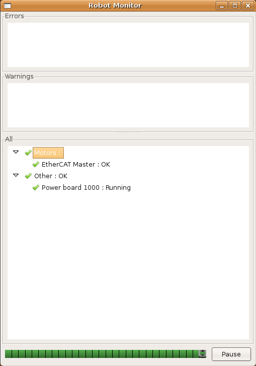

这是一个如何为diagnostics stic_aggregator编写自己的诊断分析器插件的示例。

## 概述

诊断分析器由diagnostics _aggregator使用。它们可以收集、分析和处理原始诊断数据。如果机器人开发人员希望检查整个机器人系统的诊断数据，他们应该为自己的机器人创建一个分析器。

基本的诊断分析器包含在diagnostics _aggregator包中。对于大多数目的，诊断聚合器::GenericAnalyzer和诊断聚合器::AnalyzerGroup足以进行诊断分析。有关这两种基本分析器的详细信息，请参阅使用GenericAnalyzer教程。

通过创建定制的诊断分析器，机器人操作员可以将诊断工具链扩展到整个机器人。没有diagnostics stic_aggregator，诊断输出和处理只能在节点或流程级别完成。但是对于完整的机器人来说，不同系统之间的相互作用变得很重要。

在本教程中，我们将编写一个诊断分析器来分析PR2的电机(或EtheCAT设备)。当电源板运行停止时，我们将忽略来自电机的错误消息，并报告电机驱动器的“OK”状态。(默认情况下，当运行停止时，电机报告错误，因为它们处于欠压状态)。

我们的分析器将由aggregator_node作为插件加载，并将为它提供一些诊断输入，以验证它是否工作。

本教程中的分析器需要进行一些充实，以便在真实的机器人上使用。它将需要验证输入，检查电机的其他问题，等等。为了清楚起见，本例中已删除了该代码。扩展和加强这个分析器是读者的练习。

## 创建包和文件

首先，我们需要为这个新的分析仪做一个包。在沙箱文件夹中，键入:

```
catkin_create_pkg pr2_motors_analyzer diagnostic_aggregator pluginlib roscpp diagnostic_msgs
```

将cd到目录中，并创建一个新的文件include/pr2_motors_analyzer/pr2_motors_analyzer.h，其中包含:

```
#ifndef PR2_MOTORS_ANALYZER_H
#define PR2_MOTORS_ANALYZER_H

#include <ros/ros.h>
#include <diagnostic_aggregator/analyzer.h>
#include <diagnostic_aggregator/status_item.h>
#include <diagnostic_msgs/DiagnosticStatus.h>
#include <pluginlib/class_list_macros.h>
#include <string>

namespace diagnostic_aggregator {

class PR2MotorsAnalyzer : public Analyzer
{
public:
  PR2MotorsAnalyzer();

  ~PR2MotorsAnalyzer();

  bool init(const std::string base_name, const ros::NodeHandle &n);

  bool match(const std::string name);

  bool analyze(const boost::shared_ptr<StatusItem> item);

  std::vector<boost::shared_ptr<diagnostic_msgs::DiagnosticStatus> > report();

  std::string getPath() const { return path_; }

  std::string getName() const { return nice_name_; }

private:

  // Store status item for EtherCAT master
  boost::shared_ptr<StatusItem> eth_master_item_;

  std::string path_, nice_name_, power_board_name_;

  bool runstop_hit_, has_initialized_, has_power_data_, has_eth_data_;
};

}
#endif //PR2_MOTORS_ANALYZER_H
```
这定义了诊断分析器的头部。我们定义了来自diagnostics stic_aggregator::Analyzer基类的所有纯虚函数，即

* init
* match
* analyze
* report
* getPath
* getName

为了使这个分析器更有用，我们可能需要跟踪EtherCAT集线器和其他EtherCAT设备。现在，我们来看看EtherCAT Master。

## 定义分析仪功能

现在我们要定义header中描述的函数。在pr2_motors_analyzer包中创建目录“src”。打开文件“src/pr2_motors_analyzer.cpp”。

```
#include "pr2_motors_analyzer/pr2_motors_analyzer.h"

using namespace diagnostic_aggregator;
using namespace std;

PLUGINLIB_REGISTER_CLASS(PR2MotorsAnalyzer,
                         diagnostic_aggregator::PR2MotorsAnalyzer,
                         diagnostic_aggregator::Analyzer)

PR2MotorsAnalyzer::PR2MotorsAnalyzer() :
  path_(""), nice_name_("Motors"), power_board_name_(""),
  runstop_hit_(false), has_initialized_(false), has_power_data_(false),
  has_eth_data_(false)
{ }

PR2MotorsAnalyzer::~PR2MotorsAnalyzer() { }
```
带有“PLUGINLIB_…”的行使用一个pluginlib宏来允许这个类作为插件加载。下面我们将更多地讨论如何使用pluginlib。

### 初始化

填写init()函数:

```
bool PR2MotorsAnalyzer::init(const string base_name, const ros::NodeHandle &n)
{
  // path_ = BASE_NAME/Motors
  path_ = base_name + "/" + nice_name_;

  if (!n.getParam("power_board_name", power_board_name_))
  {
     ROS_ERROR("No power board name was specified in PR2MotorsAnalyzer! Power board must be \"Power board 10XX\". Namespace: %s", n.getNamespace().c_str());
     return false;
  }

  // Make a "missing" item for the EtherCAT Master
  boost::shared_ptr<StatusItem> item(new StatusItem("EtherCAT Master"));
  eth_master_item_ = item;

  has_initialized_ = true;

  return true;
}

```
我们的分析器需要一个参数:power_board_name。电源板名称是电源板的诊断状态名称，类似于“电源板10XX”。我们可以选择指定电源板的序列号。注意，这两个值对于每个机器人都是惟一的。

正如我们所看到的，每个分析程序只查看项目名称来“匹配”一个项目。

一个真正的分析仪会检查电源板的名称是否有效。这是给读者的练习。我们不能寻找任何以“Power board”开头的诊断名称，因为在某些情况下，我们可能会看到不止一个。

### 匹配和分析

```
bool PR2MotorsAnalyzer::match(const std::string name)
{
  if (name == "EtherCAT Master")
    return true;

  return name == power_board_name_;
}
```
如果我们看到一个马达，或者电源板，我们就会报告一次匹配。因为aggregator_node缓存结果，所以对每个新状态项只调用match函数一次。

注意:由于match()只调用一次，所以分析程序不能更改它们的匹配规则。

```
bool PR2MotorsAnalyzer::analyze(const boost::shared_ptr<StatusItem> item)
{
  if (item->getName() == power_board_name_)
  {
    has_power_data_ = true;
    runstop_hit_ = item->getValue("Runstop hit") == "True" || item->getValue("Estop hit") == "True";
    return false; // Won't report this item
  }

  // We know our item is "EtherCAT Master"
  eth_master_item_ = item;
  has_eth_data_ = true;

  return true;
}
```

在analyze()函数中，如果要在输出中报告该项，则返回true。因为我们只对查看和电源板数据感兴趣，而不报告它，所以返回false。我们将报告“EtherCAT Master”项。

只对匹配项调用analyze()。我们可以添加assert()来检查该项目是电源板名称还是“EtherCAT Master”。

### 报告

分析器为每个新消息收集原始诊断信息。在1Hz时，他们必须报告状态。

```
vector<boost::shared_ptr<diagnostic_msgs::DiagnosticStatus> > PR2MotorsAnalyzer::report()
{
  boost::shared_ptr<diagnostic_msgs::DiagnosticStatus> eth_stat = eth_master_item_->toStatusMsg(path_);

  // If we have power data, and runstop is hit, we'll suppress errors
  if (has_eth_data_ && has_power_data_ && runstop_hit_)
  {
    eth_stat->level = diagnostic_msgs::DiagnosticStatus::OK;
  }

  vector<boost::shared_ptr<diagnostic_msgs::DiagnosticStatus> > output;
  output.push_back(eth_stat);

  return output;
}

```

现在我们已经成功地实现了分析器。关闭“pr2_motors_analyzer.cpp”文件，并保存它。

## 建立和测试分析仪

我们将展示如何将分析器作为插件加载并使用一些模拟诊断数据对其进行测试。

要测试这个分析器，我们可以编写一个简单的Python节点，它发布诊断信息，就像一个真正的power board和EtherCAT Master一样。我们可以查看原始和经过处理的诊断数据来验证我们的分析器。

### 构建和加载插件

在您的新包中，打开文件“CMakeLists.txt”。添加以下代码行，将分析器构建为一个库。

```
add_library(pr2_motors_analyzer
  src/pr2_motors_analyzer.cpp)
```
现在创建一个新文件“pr2_motors_analyzer_plugin.xml”。有关此文件的详细信息，请参阅pluginlib文档。如您所见，我们将类名作为“name”，分析器的完全限定名称空间作为“type”。

```
<library path="lib/libpr2_motors_analyzer" >
  <class name="PR2MotorsAnalyzer" type="diagnostic_aggregator::PR2MotorsAnalyzer" base_class_type="diagnostic_aggregator::Analyzer">
    <description>
      PR2MotorsAnalyzer is tutorial for writing diagnostic analyzers.
    </description>
  </class>
</library>
```

在“package.xml”中添加以下行。导出插件的xml文件。

```
<export>
  <!-- You may already have an "export" tag. If so, just add this inside it-->
 <diagnostic_aggregator plugin="${prefix}/pr2_motors_analyzer_plugin.xml" />
</export>
```
键入“catkin_make pr2_motors_analyzer”来构建分析器。

### 加载插件

首先，我们将检查我们的新插件是否对pluginlib和diagnostic stic_aggregator可见。使用rospack搜索插件。

```
$ rospack plugins --attrib=plugin diagnostic_aggregator
```
如果你看到“pr2_motors_analyzer PATH/TO/SANDBOX”，那么你的插件就注册了。如果没有，请再次检查依赖项，然后检查manifest.xml。

要测试分析器加载的情况，我们需要创建一个YAML文件，其中包含diagnostics stic_aggregator::PR2MotorsAnalyzer的参数。创建一个目录“test”并打开一个名为“test/pr2_motors_analyzer_load.yaml”的文件

```
analyzers:
  motors:
    type: PR2MotorsAnalyzer
    power_board_name: Power board 1000
```
创建另一个名为“test/test_pr2_motors_analyzer_load.launch”的文件

```
<launch>
  <test pkg="diagnostic_aggregator" type="analyzer_loader"
        name="loader" test-name="pr2_motors_analyzer_load_test" >
    <rosparam command="load"
              file="$(find pr2_motors_analyzer)/test/pr2_motors_analyzer_load.yaml" />
  </test>
</launch>
```
现在使用rostest来确保新插件加载成功。

```
rostest test/test_pr2_motors_analyzer_load.launch
```
它应该会成功加载。

添加

```
rosbuild_add_rostest(test/test_pr2_motors_analyzer_load.launch)
```
到“CMakeLists.txt文件。键入“make test”来运行这个负载测试。这将确保您的分析器总是成功地加载给定的正确参数，并防止回归。

### 生成诊断输入

我们将使用rospy发布者生成伪诊断输入，并同时在rqt_runtime_monitor和rqt_robot_monitor (runtime_monitor、robot_monitor，如果比Groovy更早的话)中查看诊断。

在pr2_motors_analyzer包中创建一个目录“scripts”。打开“scripts/ pr2_power_pub.py”

```
#!/usr/bin/env python

import roslib; roslib.load_manifest('pr2_motors_analyzer')

import rospy
from diagnostic_msgs.msg import DiagnosticArray, DiagnosticStatus, KeyValue

if __name__ == '__main__':
    rospy.init_node('pr2_motor_power_sim')

    pub = rospy.Publisher('/diagnostics', DiagnosticArray)

    array = DiagnosticArray()
    # Fake power board status, estop is on
    power_stat = DiagnosticStatus(name = 'Power board 1000', level = 0,
                                  message = 'Running')
    power_stat.values = [ KeyValue(key = 'Runstop hit', value = 'False'),
                          KeyValue(key = 'Estop hit', value = 'False')]
    # Fake EtherCAT Master status, all OK
    eth_stat = DiagnosticStatus(name='EtherCAT Master', level = 0,
                                message = 'OK')

    array.status = [ power_stat, eth_stat ]

    my_rate = rospy.Rate(1.0)
    while not rospy.is_shutdown():
        pub.publish(array)
        my_rate.sleep()
```
创建另一个文件，”scripts/pr2_power_pub_estop_hit。并更改上面的这些行:
```
# Fake power board status, estop is hit
    power_stat = DiagnosticStatus(name = 'Power board 1000', level = 0,
                                  message = 'Running')
    power_stat.values = [ KeyValue(key = 'Runstop hit', value = 'False'),
                          KeyValue(key = 'Estop hit', value = 'True')]
    # Fake EtherCAT Master status, level is Error
    eth_stat = DiagnosticStatus(name='EtherCAT Master', level = 2,
                                message = 'Motors Halted')

```

使两个文件都可执行。在“package.xml”中添加rospy和diagnostics _msgs的依赖项.

###  测试分析仪
创建一个启动文件“test/test_estop_ok.launch”。
```
<launch>
  <node pkg="pr2_motors_analyzer" type="pr2_power_pub.py" name="diag_pub" />

  <node pkg="diagnostic_aggregator" type="aggregator_node" name="diag_agg" >
      <rosparam command="load"
              file="$(find pr2_motors_analyzer)/test/pr2_motors_analyzer_load.yaml" />
  </node>
</launch>
```

这将在/diagnostics主题上发布假数据，并启动aggregator_node。

启动这个文件，并运行rqt_runtime_monitor(即rqt_runtime_monitor)。runtime_monitor):

```
$ rosrun rqt_runtime_monitor rqt_runtime_monitor
$ rosrun runtime_monitor monitor  ## Ealier than `Groovy`
```
rqt_runtime_monitor将显示关于/诊断的原始数据。您应该看到
```
EtherCAT Master: OK
Power board 1000: Running
```
使用rqt_robot_monitor(即rqt_robot_monitor)查看聚合的数据。robot_monitor):
```
$ rosrun rqt_robot_monitor rqt_robot_monitor
$ rosrun robot_monitor robot_monitor  ## Ealier than `Groovy`

```


现在，当estop“命中”时测试分析器。关闭aggregator_node、runtime_monitor和rqt_robot_monitor。将上面的启动文件复制到“test/test_estop_hit”。启动，并使用节点“pr2_power_pub_estop_hit.py”。像以前一样重新运行所有内容。

rqt_runtime_monitor:
```
EtherCAT Master: Motors Halted # This is in "Error" state
Power board 1000: Running
```
但是robot_monitor显示的是带有绿色检查的“马达”，这意味着它们没有问题。

PR2MotorsAnalyzer使用来自电源板的数据成功地清除了电机的错误状态。