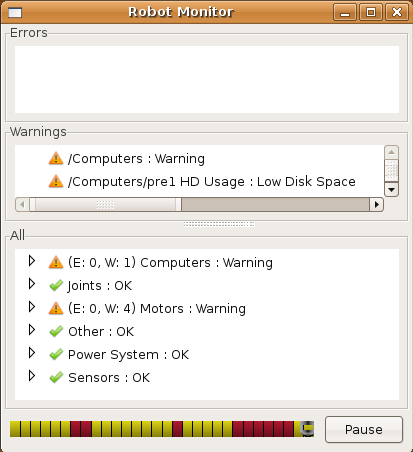
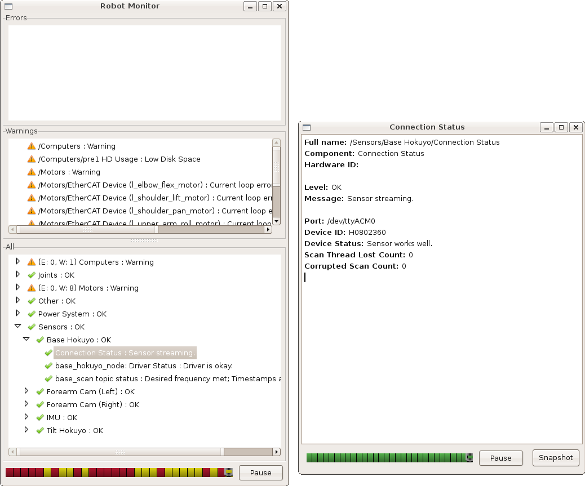
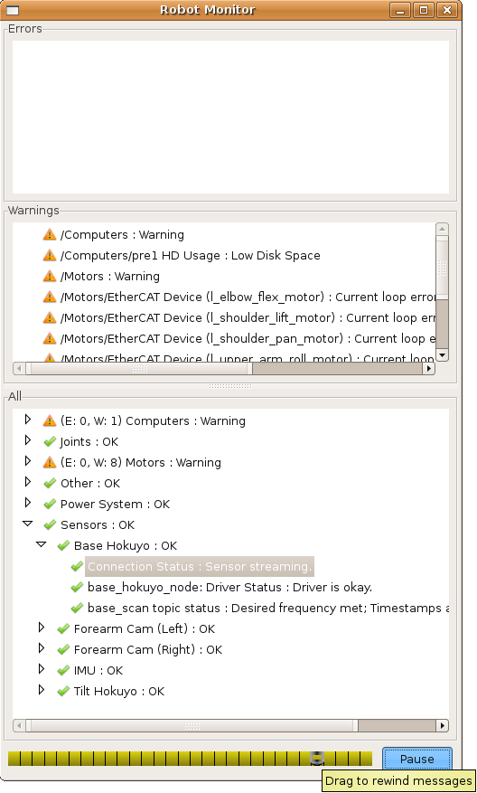
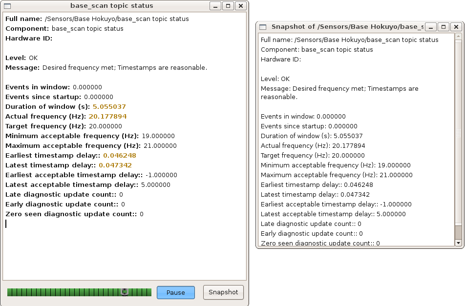

机器人监视器用于查看机器人的聚合诊断。查看诊断数据来诊断和调试硬件和驱动程序问题非常有用。

## 概述
rqt_robot_monitor包(Groovy之前的robot_monitor)用于查看机器人诊断数据。机器人监控工具侦听来自诊断聚合器的分析数据。使用机器人监视器，用户可以观察、分析和报告硬件、设备或驱动程序的问题。

Robot Monitor是pr2_dashboard的一部分。
## 启动RobotMonitor

### 构建
在你的机器上安装ROS，如果你还没有安装，那么:

```
$ apt-get install ros-%YOUR_ROS_DISTRO%-rqt-robot-monitor
```

如果你使用的是ROS比Groovy更早:
```
$ rosdep install robot_monitor
$ rosmake robot_monitor
```

### 设置和连接

#### 设置ROS Master
首先，确保您的ROS Master指向正确的位置。
```
$ echo $ROS_MASTER_URI
```
应该打印如下内容:
```
http://localhost:11311/
```
如果“localhost”不是您的机器人的名称，请设置您的master。
```
$ export ROS_MASTER_URI=http://COMPUTER_NAME:11311/
```
#### 检查topic
您可能需要确保您的机器人已为机器人监视器正确配置。如果您正在使用柳树车库PR2，机器人将已经配置好，您可以跳过这一步。如果您不确定您的机器人，请使用以下步骤来检查它。

为了使用机器人监视器，机器人必须运行diagnostics _aggregator。如果您的机器人是Willow Garage PR2，它将自动运行聚合工具。如果你不确定，检查一下:

```
$ rostopic list | grep diagnostics
```

如果在输出中看到“/diagnostics s_agg”，则聚合器正在运行。

如果没有看到“/diagnostics s_agg”，则必须在机器人上设置一个diagnostics _aggregator。有关详细信息，请参阅配置诊断聚合器教程。
## 使用Robot Monitor
设置好Master之后，输入:
```
$ rosrun rqt_robot_monitor rqt_robot_monitor
$ rosrun robot_monitor robot_monitor  ## Ealier than Groovy
```

在同一个终端。

机器人监视器将启动并显示来自机器人的输入数据。

在底部窗口中，使用树控件展开或折叠每个类别中的子项目。

#### 状态查看器
要查看更详细的项目，双击，将弹出一个查看器。多个视图可用于不同的项。

为了便于复制和粘贴，请对项进行“快照”。一个新的窗口将弹出冻结状态。

完成项目后，关闭查看器。
#### 复卷和回放
使用机器人监视器面板底部的时间轴，您可以返回到最近的消息，查看间歇性错误。只需沿着时间轴拖动刻度盘。所有状态查看器都将随着时间轴的更改而更新。当您使用时间轴工具时，机器人监视器将暂停，不会更新。

如欲继续“即时”浏览，请按“暂停”键。
#### 详细的复卷
使用状态查看器，您可以一次倒带并回放一个项目。使用该状态查看器中的时间轴工具拖动到前面的消息。为了方便复制和粘贴，拍一张“快照”。

按“暂停”键继续直播。快照窗口将一直保持打开状态，直到您关闭它。
## 缩写

如果这是一个您将经常使用的机器人，并且您使用bash，那么为这个Master设置一个别名可能会更好。在~/.bashrc中添加以下行。ros文件:
```
$ alias NAME='export ROS_MASTER_URI=http://COMPUTER_NAME:11311/'
```
用适当的计算机昵称和计算机名替换名称和COMPUTER_NAME。

一些用户还喜欢为机器人监视器设置别名。如果您经常使用这个机器人，最好设置一个别名，以便更容易地启动。如果您已经为计算机设置了别名，那么也可以为机器人监视器设置别名。
```
$ alias viewer='rosrun rqt_robot_monitor rqt_robot_monitor'
```
现在输入:
```
NAME
viewer
```

将打开从计算机“COMPUTER_NAME”订阅/diagnostics s_agg的机器人监视器。