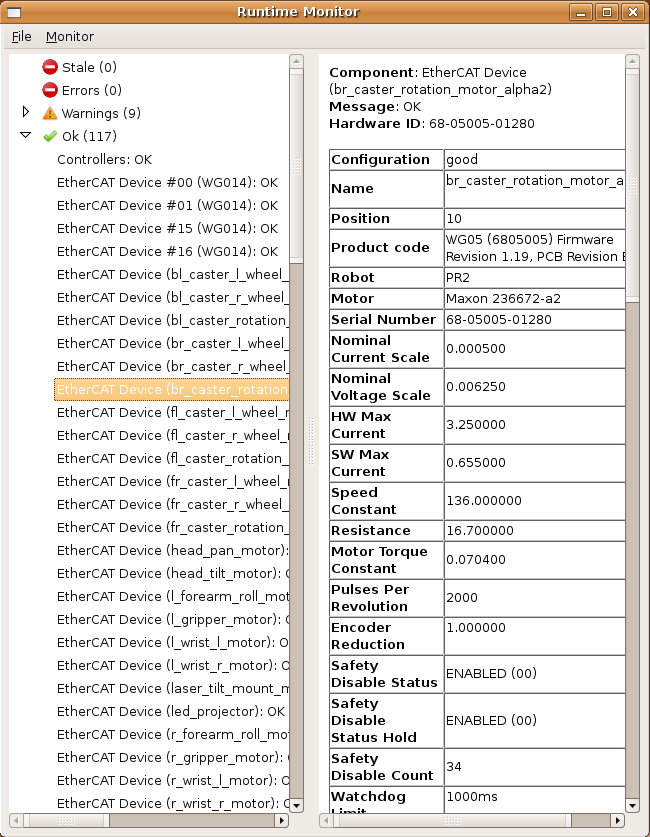

runtime_monitor是监视机器人状态的有用工具。它订阅“/diagnostics”主题，并以简单易用的格式显示数据。

## 概述
运行时监视器(在runtime_monitor包中)通过侦听“/diagnostics”主题来显示原始诊断数据。它对于实时查看诊断数据非常有用。

对于具有诊断聚合器的机器人，推荐使用robot_monitor。通常，小型或简单的机器人将没有诊断聚合器，因此用户将不得不使用运行时监视器。
## 构建
如果还没有安装ROS，那么构建运行时监视器:
```
$ rosdep install runtime_monitor
$ rosmake runtime_monitor
```
## 运行
### 设置正确的master
首先，确保您的ROS master指向正确的位置。
```
$ echo $ROS_MASTER_URI
```
会打印出
```
http://localhost:11311/
```
如果“localhost”不是您的机器人的名称，请设置您的master:
```
$ export ROS_MASTER_URI=http://COMPUTER_NAME:11311/
```
如果这是一个您将经常使用的机器人，那么为该master设置一个别名可能会更好。将以下行添加到您的“~/.bashrc.ros”中:
```
$ alias NAME='export ROS_MASTER_URI=http://COMPUTER_NAME:11311/'
```
 用适当的计算机昵称和计算机名替换名称和COMPUTER_NAME。
### 启动monitor

rosrun 运行:

```
$ rosrun runtime_monitor monitor
```

## 查看数据
在屏幕的左侧，诊断数据将按名称显示。它们将根据状态分为“陈旧”、“错误”、“警告”或“OK”。

要查看项目的完整状态，单击它，数据将出现在右边的窗口中。通过在窗口中滚动，您可以跟踪查看状态，并监视更改。



## 其他特性

### 重设监控器
在一项停止发布诊断信息约5秒后，它将移动到监视器左侧的“陈旧”标题。若要清除陈旧的项目，请在菜单中使用“Monitor >> Reset Monitor”。监视器将很快用所有当前项重新填充。
### 修改topic

在某些情况下，诊断结果不会发布在“/diagnostics”上。若要更改主题，请使用菜单中的“Monitor >> change topic”选项。

重要提示:运行时监视器只能监听类型为“diagnostics s_msgs/ diagnostics array”的主题。


## 缩写

一些用户还喜欢为运行时监视器设置别名。

$ alias runtime='rosrun runtime_monitor monitor'

现在输入:
```
NAME
runtime
```
将打开一个运行时监视器，该监视器订阅计算机“COMPUTER_NAME”中的诊断信息。
