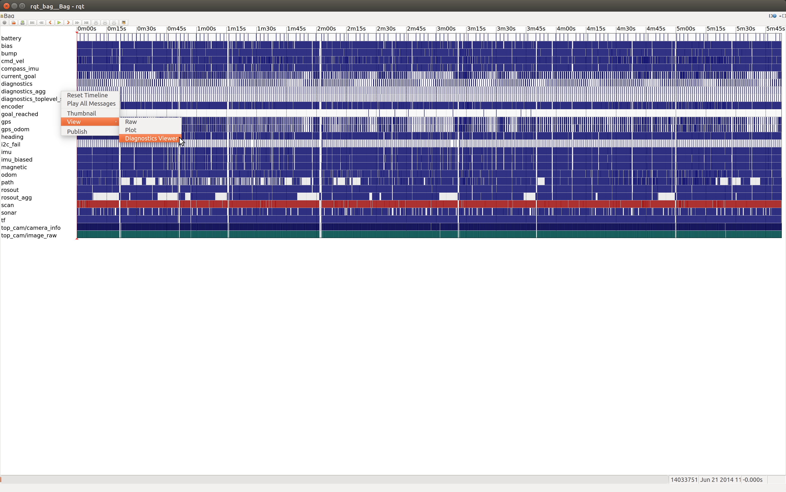
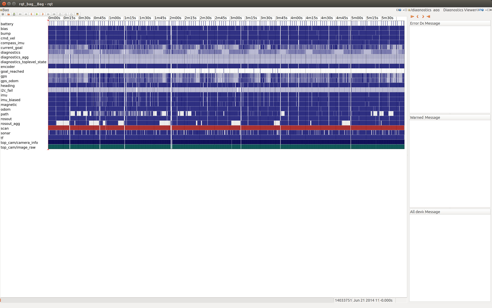
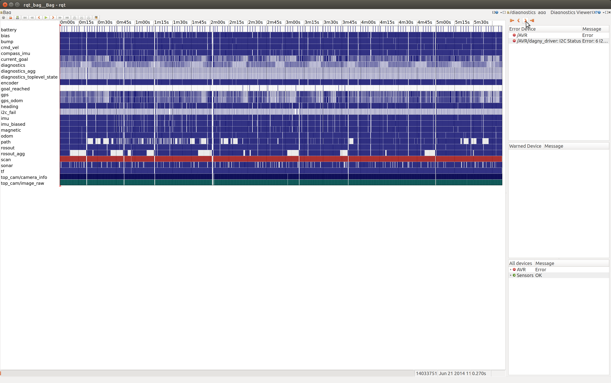

## 概述

rqt_robot_monitor包包含一个rqt_bag插件，可用于直接在rqt_bag中查看诊断数据。如果您安装了rqt_bag和rqt_robot_monitor，这个插件将自动加载。

rqt_bag需要一个roscore。如果你没有一个roscore运行，开始一个:
```
roscore
```
In a new terminal, run rqt_bag on a bag that contains diagnostic data (the /diagnostics or /diagnostics_agg topic):
```
rqt_bag my_data.bag
```
在一个新的终端中，在一个包含诊断数据(/diagnostics或/diagnostics s_agg主题)的包上运行rqt_bag:

当rqt_bag打开时，右键单击diagnostics s_agg主题来可视化它:



诊断查看器可能显示格式很差，并且将为空。我更喜欢把它放在屏幕的右边，像这样:



现在，您可以使用playhead来搜索日志文件，或者使用箭头按钮一次移动一条诊断消息:


(这里你可以看到我的机器人在这个日志的开头有一些I2C问题)
